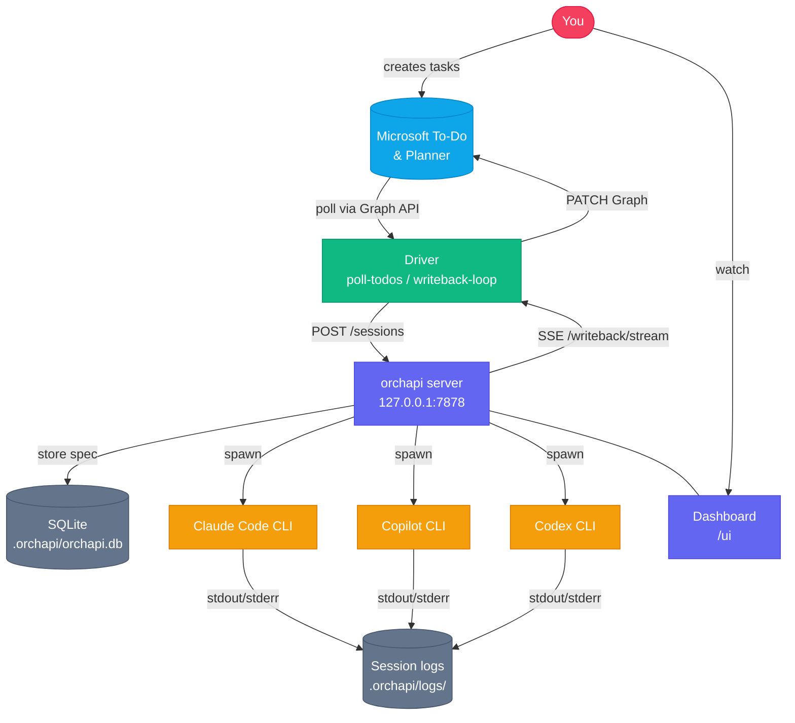

# orchapi

[](https://github.com/enu235/orchapi/actions)
[](LICENSE)

**orchapi** is a local Rust server that turns your Microsoft To-Do and Planner tasks into fully autonomous AI coding sessions. It dispatches tasks to Claude Code, GitHub Copilot CLI, or OpenAI Codex, manages concurrency, streams live output, and writes results back to Microsoft Graph when each session finishes — all without leaving your machine.

---

## System overview



---

## Features

- **Multi-agent dispatch** — route tasks to Claude Code, GitHub Copilot CLI, or OpenAI Codex with a single REST call
- **Profile system** — define reusable session templates (system prompt, tools, model, budget, working directory) in simple TOML files; merge precedence: config defaults < profile < per-request overrides
- **Microsoft Graph integration** — driver polls To-Do lists and Planner boards, deduplicates by etag, and patches task status on writeback
- **Live streaming** — per-session SSE endpoint (`/sessions/:id/stream`) and writeback SSE endpoint (`/writeback/stream`)
- **Concurrency control** — global and per-agent limits; sessions queue automatically when limits are reached
- **Durable state** — sessions survive server restarts; stale running sessions are auto-cancelled on startup
- **Embedded dashboard** — visit `/ui` in any browser for a live session view
- **Zero cloud dependencies** — everything runs locally; Microsoft Graph is the only external service

---

## Quick start

### 1. Install

**macOS / Linux:**
```bash
curl --proto '=https' --tlsv1.2 -sSf \
  https://raw.githubusercontent.com/enu235/orchapi/main/install.sh | sh
```

**Windows (PowerShell):**
```powershell
iwr -useb https://raw.githubusercontent.com/enu235/orchapi/main/install.ps1 | iex
```

See [INSTALL.md](INSTALL.md) for manual installation and all installer flags.

### 2. Authenticate with Microsoft Graph

```bash
cd driver
python3 .claude/skills/todo-poll/poll.py --login
```

A device-code URL is printed. Open it in your browser and sign in. The token is cached in `driver/state/token_cache.bin` (gitignored).

### 3. Configure

```bash
cp config.toml.example config.toml                        # server settings
cp driver/config/driver.toml.example driver/config/driver.toml
cp driver/config/routes.toml.example driver/config/routes.toml
```

Edit `driver/config/routes.toml` to point your To-Do lists at the right profiles and working directories.

### 4. Start the server

```bash
orchapi
# → orchapi listening on http://127.0.0.1:7878
# → Dashboard: http://127.0.0.1:7878/ui
```

### 5. Open the driver and run

**With Claude Code:**

```bash
claude --cwd driver/
```

Inside the Claude Code session:

```
/poll-todos              # one dispatch cycle
/loop 5m /poll-todos     # recurring loop every 5 minutes
/writeback-loop          # start the writeback worker
```

**With GitHub Copilot CLI:**

```bash
cd driver/
copilot -p "/poll-todos" -s --allow-all-tools       # one dispatch cycle
copilot -p "/writeback-loop" -s --allow-all-tools   # start the writeback worker
```

See [docs/driver.md](docs/driver.md) for the full driver guide, and [docs/executors/](docs/executors/) for per-CLI setup instructions.

---

## How it works

1. **Poll** — the driver calls Microsoft Graph, fetches pending To-Do and Planner tasks, and deduplicates them against `driver/state/seen.sqlite`.
2. **Route** — each task is matched against `routes.toml` rules (by list name, title regex, or source). Unmatched tasks fall back to LLM-assisted routing.
3. **Dispatch** — the driver calls `POST /sessions` on orchapi with a resolved spec (agent, profile, action prompt, working directory, external task reference).
4. **Execute** — orchapi spawns the agent CLI as a child process, streams its output to a per-session log file, and tracks state in SQLite.
5. **Writeback** — when a session reaches a terminal state, the writeback SSE stream notifies the driver, which PATCHes the source task in Microsoft Graph (marks complete, appends summary).

For deeper detail see the [docs/](docs/) directory.

---

## Project layout

| Path | Description |
|---|---|
| `src/` | Rust server source |
| `src/main.rs` | Axum router, startup, `AppState` |
| `src/manager.rs` | Session lifecycle, concurrency, writeback broadcast |
| `src/adapters/` | Per-agent CLI adapters (`claude.rs`, `copilot.rs`, `codex.rs`) |
| `src/spec.rs` | Session spec types and `resolve_spec` merge logic |
| `src/store.rs` | SQLite pool, queries, migrations |
| `src/config.rs` | Config and profile types |
| `src/api/` | Axum route handlers (sessions, profiles, writeback, UI) |
| `profiles/` | TOML session profile templates |
| `config.toml.example` | Annotated server configuration template |
| `migrations/` | SQLite schema migrations |
| `assets/index.html` | Embedded dashboard SPA |
| `driver/` | Python driver workspace (open with `claude --cwd driver/`) |
| `driver/config/` | `driver.toml`, `routes.toml` (copy from `.example` files) |
| `driver/state/` | Runtime state: `seen.sqlite`, `token_cache.bin` (gitignored) |
| `.orchapi/` | Runtime data: `orchapi.db`, `logs/` (gitignored) |

---

## Documentation

| Topic | File |
|---|---|
| Installation & upgrade | [INSTALL.md](INSTALL.md) |
| Contributing & dev setup | [CONTRIBUTING.md](CONTRIBUTING.md) |
| Security & attack surface | [SECURITY.md](SECURITY.md) |
| Driver configuration | [driver/README.md](driver/README.md) |

---

## License

MIT — see [LICENSE](LICENSE).

## Contributing

Issues and pull requests are welcome. Please read [CONTRIBUTING.md](CONTRIBUTING.md) before opening a PR.
