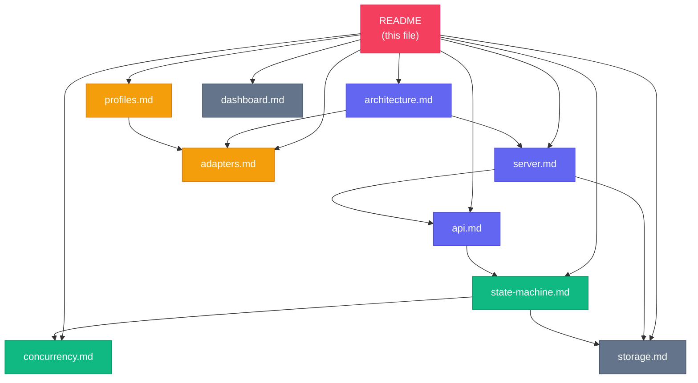

# orchapi Documentation

orchapi is a local Rust HTTP server that orchestrates Claude Code, GitHub Copilot CLI, and OpenAI Codex sessions. It persists everything to SQLite, streams live output over SSE, and integrates with a Python driver that polls Microsoft To-Do and Planner.

## Documents

### Server

| File | What it covers |
|------|---------------|
| [architecture.md](architecture.md) | Top-level system diagram, component descriptions, startup sequence |
| [server.md](server.md) | Rust module map, AppState, request flow from router to store |
| [api.md](api.md) | Full HTTP API reference with curl examples and sequence diagrams |
| [adapters.md](adapters.md) | How each adapter (Claude, Copilot, Codex) builds its CLI command |
| [profiles.md](profiles.md) | Profile file format, merge precedence, template interpolation, examples |
| [state-machine.md](state-machine.md) | Session lifecycle states, transitions, writeback sub-state |
| [concurrency.md](concurrency.md) | Two-semaphore model, queuing, cancellation, tuning tips |
| [storage.md](storage.md) | SQLite schema, log layout, migrations, manual query examples |
| [dashboard.md](dashboard.md) | Dashboard (/ui) usage guide, modal fields, SSE log stream |

### Driver and operations

| File | What it covers |
|------|---------------|
| [installation.md](installation.md) | Prerequisites, curl installer, all flags, manual steps, platform notes |
| [operations.md](operations.md) | Starting the server, log levels, dashboard, curl queries, managing sessions |
| [driver.md](driver.md) | Driver workspace overview: directory layout, commands, skills, subagent, workflow |
| [driver-poll.md](driver-poll.md) | Poll cycle deep-dive: all 9 steps, in-flight cap, deduplication, Planner enrichment, output schema |
| [driver-router.md](driver-router.md) | Routing rules format, match semantics, LLM fallback, example routes.toml |
| [driver-writeback.md](driver-writeback.md) | Writeback system: claim/ack protocol, note format, 412 handling, Graph update targets |
| [microsoft-graph.md](microsoft-graph.md) | MSAL auth flow, required scopes, client ID, tenant values, token cache, PowerShell mode |
| [troubleshooting.md](troubleshooting.md) | Symptom/cause/fix table covering 15+ common issues, plus debugging checklist |

## Site map



## Quick start

```bash
# build and run
cargo run

# open dashboard
open http://127.0.0.1:7878/ui

# create a session from the CLI
curl -s -X POST http://127.0.0.1:7878/sessions \
  -H 'Content-Type: application/json' \
  -d '{
    "agent": "claude",
    "profile": "default",
    "overrides": {
      "action_prompt": "List the files in the current directory.",
      "cwd": "/tmp"
    }
  }' | jq .
```

## Versions

The server reports its version at `GET /healthz`. The current source version is `0.1.0` (see `Cargo.toml`).
