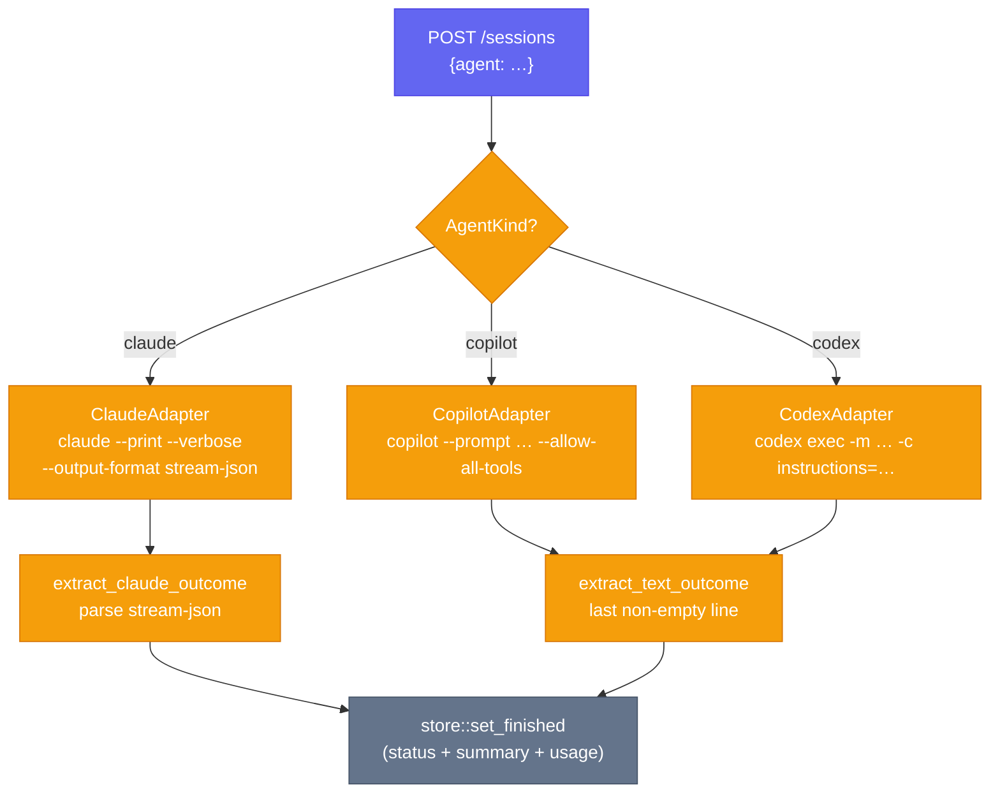

# Adapters

An adapter is a small Rust struct that knows how to turn a resolved `SessionSpec` into a CLI command and how to extract a human-readable summary from the finished log.

## AgentAdapter trait

```rust
// src/adapters/mod.rs
pub trait AgentAdapter: Send + Sync {
    fn kind(&self) -> AgentKind;
    fn build_command(&self, spec: &SessionSpec) -> Result<Command>;
    fn extract_outcome(&self, log: &str, exit_code: i32) -> Outcome;
}
```

The `adapter_for` factory function returns the right boxed trait object:

```rust
pub fn adapter_for(kind: &AgentKind) -> Box<dyn AgentAdapter> {
    match kind {
        AgentKind::Claude  => Box::new(ClaudeAdapter),
        AgentKind::Copilot => Box::new(CopilotAdapter),
        AgentKind::Codex   => Box::new(CodexAdapter),
    }
}
```

---

## Claude adapter (`src/adapters/claude.rs`)

Spawns: `claude --print --verbose --output-format stream-json --include-partial-messages [flags] -- <action_prompt>`

### SessionSpec → CLI flags

| SessionSpec field | CLI flag | Notes |
|-------------------|----------|-------|
| `cwd` | `Command::current_dir` | set on the `Command`, not a flag |
| `env` | `Command::envs` | merged env map applied to the process |
| `model` | `--model <value>` | omitted if `None` |
| `system_prompt` | `--append-system-prompt <value>` | appended, not replaced |
| `permission_mode` | `--permission-mode <value>` | e.g. `acceptEdits` |
| `allowed_tools` | `--allowed-tools <t1> <t2> …` | omitted if empty |
| `disallowed_tools` | `--disallowed-tools <t1> <t2> …` | omitted if empty |
| `plugin_dirs` | `--plugin-dir <dir>` (repeated) | one flag per entry |
| `mcp_configs` | `--mcp-config <path>` (repeated) | one flag per entry |
| `max_budget_usd` | `--max-budget-usd <n>` | omitted if `None` |
| `effort` | `--effort <value>` | omitted if `None` |
| `max_turns` | `--append-system-prompt "(Stop after at most N turns of tool use.)"` | Claude CLI has no `--max-turns` flag yet; injected as a system prompt note |
| `action_prompt` | positional arg after `--` | always last |

### Outcome extraction

Calls `extract_claude_outcome(log, exit_code)` which scans the stream-json log line by line:

1. Lines with `"type": "result"` → uses `result` field text (truncated to 300 chars) and `usage` object.
2. Lines with `"type": "assistant"` → scans `message.content` array for text blocks; last text block wins.

If no JSON result line is found the summary is `None`. `exit_code == 0` → `OutcomeKind::Success`, otherwise `OutcomeKind::Failed`.

### Special cases

- **`max_turns`**: Claude Code CLI does not yet expose `--max-turns`. The adapter injects it as an extra `--append-system-prompt` call with the text `"(Stop after at most N turns of tool use.)"`.
- **Multiple `--append-system-prompt` calls**: if both `system_prompt` (from profile) and `max_turns` are set, the adapter issues two separate `--append-system-prompt` flags; Claude concatenates them.

---

## Copilot adapter (`src/adapters/copilot.rs`)

Spawns: `copilot --prompt <prompt> --allow-all-tools [flags]`

### SessionSpec → CLI flags

| SessionSpec field | CLI flag | Notes |
|-------------------|----------|-------|
| `cwd` | `Command::current_dir` | |
| `env` | `Command::envs` | |
| `system_prompt` + `agent_name` | `--agent <tempfile_path>` | writes a JSON agent definition `{name, description, instructions}` to a temp file; leaks the file so it outlives the process |
| `system_prompt` only (no `agent_name`) | prompt is prepended: `"<system_prompt>\n\n<action_prompt>"` | inline, no extra flag |
| `agent_name` only (no `system_prompt`) | `--agent <name>` | uses a named agent already known to Copilot |
| `model` | `--model <value>` | omitted if `None` or `"default"` |
| `plugin_dirs` | `--add-dir <dir>` (repeated) | |
| `mcp_configs` | `--additional-mcp-config <path>` (repeated) | |
| `effort` | `--effort <value>` | |
| `action_prompt` | `--prompt <value>` | always included (possibly prefixed with system prompt) |

`--allow-all-tools` is always passed.

### Outcome extraction

Calls `extract_text_outcome(log, exit_code)` which finds the last non-empty line of the log (after stripping `[OUT] ` and `[ERR] ` prefixes) and truncates to 300 chars. No usage data is extracted.

### Special cases

- **Tempfile agent**: when `system_prompt` and `agent_name` are both set, a `NamedTempFile` is created with a JSON agent definition. The temp file is kept alive by calling `.keep()` — the OS cleans it up when the process exits. This is intentional: the Copilot process needs the file to exist for its lifetime.
- **model `"default"`**: if `model` is exactly the string `"default"`, the `--model` flag is omitted so Copilot uses its own default.

---

## Codex adapter (`src/adapters/codex.rs`)

Spawns: `codex exec [-m <model>] [-c instructions=<system_prompt>] [-c sandbox_mode=<…>] [-c reasoning_effort=<…>] [-c max_turns=<n>] <action_prompt>`

### SessionSpec → CLI flags

| SessionSpec field | CLI flag | Notes |
|-------------------|----------|-------|
| `cwd` | `Command::current_dir` | |
| `env` | `Command::envs` | |
| `model` | `-m <value>` | |
| `system_prompt` | `-c instructions=<value>` | Debug-formatted string to handle quotes |
| `mcp_configs[0]` | `-c sandbox_mode=<value>` | **Repurposed field** — first MCP config entry is used as the Codex sandbox mode (e.g. `"workspace-write"`) |
| `effort` | `-c reasoning_effort=<value>` | maps to Codex `reasoning_effort` config key |
| `max_turns` | `-c max_turns=<n>` | |
| `action_prompt` | positional arg | always last |

### Outcome extraction

Calls `extract_text_outcome(log, exit_code)` — same as Copilot: last non-empty log line, 300-char truncation.

### Special cases

- **`mcp_configs` repurposed**: Codex has no MCP config file concept. The adapter borrows `mcp_configs[0]` as a way to pass `sandbox_mode` without adding a new field to `SessionSpec`. If you need to set sandbox mode via a profile, put the mode string as the first element of `mcp_configs`.
- **String quoting**: `system_prompt`, `sandbox_mode`, and `reasoning_effort` are all passed through Rust's `{:?}` debug formatter, which wraps the string in double quotes and escapes interior quotes. This matches Codex's expected `-c key=<quoted-string>` format.

---

## Adding a new adapter

1. Create `src/adapters/myagent.rs` implementing `AgentAdapter`:

   ```rust
   use crate::adapters::AgentAdapter;
   use crate::outcome::{extract_text_outcome, Outcome};
   use crate::spec::{AgentKind, SessionSpec};
   use anyhow::Result;
   use tokio::process::Command;

   pub struct MyAgentAdapter;

   impl AgentAdapter for MyAgentAdapter {
       fn kind(&self) -> AgentKind { AgentKind::MyAgent }

       fn build_command(&self, spec: &SessionSpec) -> Result<Command> {
           let mut cmd = Command::new("myagent");
           cmd.current_dir(&spec.cwd);
           cmd.envs(&spec.env);
           cmd.arg(&spec.action_prompt);
           Ok(cmd)
       }

       fn extract_outcome(&self, log: &str, exit_code: i32) -> Outcome {
           extract_text_outcome(log, exit_code)
       }
   }
   ```

2. Add `AgentKind::MyAgent` to the enum in `src/spec.rs` and implement `Display` + `FromStr`.

3. Register in `src/adapters/mod.rs`:
   ```rust
   mod myagent;
   pub use myagent::MyAgentAdapter;

   pub fn adapter_for(kind: &AgentKind) -> Box<dyn AgentAdapter> {
       match kind {
           AgentKind::MyAgent => Box::new(MyAgentAdapter),
           // …existing arms
       }
   }
   ```

4. Add per-agent concurrency config and defaults to `src/config.rs` following the pattern of `claude_sem` / `ClaudeDefaults`.

5. Add the new semaphore field to `SessionManager` in `src/manager.rs` and wire it in `agent_sem()`.

---

## Adapter decision flowchart


