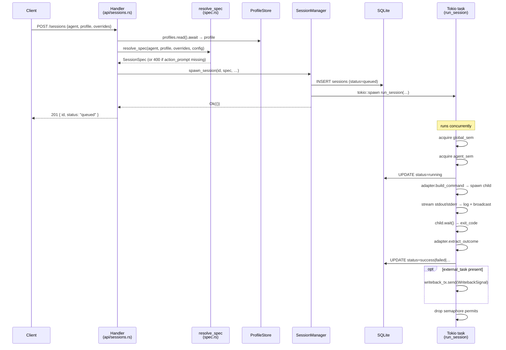

# HTTP API Reference

## Basics

| Item | Value |
|------|-------|
| Base URL | `http://127.0.0.1:7878` (default; set via `server.bind` in `config.toml`) |
| Auth | None — orchapi is a localhost-only service |
| Request content-type | `application/json` |
| Response content-type | `application/json` (except `/sessions/:id/logs` → `text/plain`, SSE endpoints → `text/event-stream`, `/ui` → `text/html`) |
| Session IDs | UUID v7 strings (time-sortable) |

---

## Endpoints

### POST /sessions

Create a new session. The server resolves the spec immediately and returns `201 Created`. The session starts executing asynchronously.

**Request body**

```json
{
  "agent": "claude",          // required: "claude" | "copilot" | "codex"
  "profile": "default",       // optional: name of a profiles/*.toml file
  "parent_session": "…",      // optional: parent session UUID
  "tags": ["todo:abc"],       // optional: free-form tag strings

  "overrides": {
    "action_prompt": "…",     // REQUIRED: the task instruction for the agent
    "system_prompt": "…",     // optional: appended to or replaces profile system prompt
    "cwd": "/path/to/repo",   // optional: working directory (supports {{var}} templates)
    "model": "sonnet",        // optional: model override
    "env": {"KEY": "value"},  // optional: extra environment variables (additive)
    "allowed_tools": […],     // optional: tool allowlist (Claude only)
    "disallowed_tools": […],  // optional: tool blocklist (Claude only)
    "permission_mode": "…",   // optional: e.g. "acceptEdits" (Claude only)
    "mcp_configs": […],       // optional: paths to MCP config files
    "plugin_dirs": […],       // optional: plugin directory paths (Claude only)
    "max_turns": 40,          // optional: max tool-use turns
    "max_budget_usd": 1.0,    // optional: spend cap (Claude only)
    "effort": "high",         // optional: reasoning effort hint
    "agent_name": "mybot",    // optional: Copilot agent name or path
    "cancel_grace_seconds": 10,
    "vars": {"REPO": "/src"},  // optional: template variables for {{REPO}} in cwd
    "external_task": {         // optional: Microsoft Graph back-reference for writeback
      "source": "todo",
      "todo": {
        "list_id": "…",
        "task_id": "…",
        "etag": "…"
      },
      "planner": null
    }
  }
}
```

**Response — 201 Created**

```json
{ "id": "0192abc…", "status": "queued" }
```

**Errors**

| Code | Reason |
|------|--------|
| 400 | Unknown `agent`, missing `action_prompt`, or spec validation error |
| 500 | Database error or unexpected failure |

**curl example**

```bash
curl -s -X POST http://127.0.0.1:7878/sessions \
  -H 'Content-Type: application/json' \
  -d '{
    "agent": "claude",
    "profile": "default",
    "overrides": {
      "action_prompt": "List the top-level files in the working directory.",
      "cwd": "/tmp"
    }
  }' | jq .
```

---

### GET /sessions

List sessions. Returns up to 50 sessions ordered by `queued_at DESC`.

**Query parameters**

| Parameter | Type | Description |
|-----------|------|-------------|
| `status` | string | Filter by status: `queued`, `running`, `success`, `failed`, `cancelled`, `timeout` |
| `agent` | string | Filter by agent: `claude`, `copilot`, `codex` |
| `profile` | string | Filter by profile name |
| `limit` | integer | Max results (default 50, max 500) |
| `since` | string | RFC 3339 timestamp — only return sessions queued at or after this time |
| `writeback_status` | string | Filter by writeback sub-state: `pending`, `in_progress`, `done`, `failed` |

**Response — 200 OK**

Array of session objects (see `GET /sessions/:id` for the object shape).

**curl example**

```bash
# all running sessions
curl -s 'http://127.0.0.1:7878/sessions?status=running' | jq .

# last 10 claude sessions
curl -s 'http://127.0.0.1:7878/sessions?agent=claude&limit=10' | jq .
```

---

### GET /sessions/:id

Get a single session by UUID.

**Response — 200 OK**

```json
{
  "id": "0192abc…",
  "agent": "claude",
  "profile": "default",
  "status": "success",
  "queued_at": "2026-05-10T12:00:00Z",
  "started_at": "2026-05-10T12:00:01Z",
  "finished_at": "2026-05-10T12:00:45Z",
  "exit_code": 0,
  "outcome_summary": "Listed 12 files in /tmp.",
  "usage": { "input_tokens": 1234, "output_tokens": 56 },
  "log_path": ".orchapi/logs/2026/05/10/0192abc….log",
  "parent_session": null,
  "tags": ["todo:abc"],
  "spec": { … },
  "external_task": null,
  "writeback_status": null,
  "writeback_attempts": 0,
  "writeback_last_error": null
}
```

**Errors**: 404 if not found.

**curl example**

```bash
curl -s http://127.0.0.1:7878/sessions/0192abc… | jq .status
```

---

### GET /sessions/:id/logs

Get the raw log file for a session as plain text.

**Response — 200 OK** (`text/plain`)

```
[OUT] Listing files…
[OUT] file1.txt
[ERR] warning: …
```

**Errors**: 404 if session or log file not found.

**curl example**

```bash
curl -s http://127.0.0.1:7878/sessions/0192abc…/logs
```

---

### GET /sessions/:id/stream  (SSE)

Stream session output as Server-Sent Events.

- **Live session**: taps into the broadcast channel; events arrive as the child process produces output.
- **Finished session**: replays the log file line by line, then sends a final `outcome` event.

**Event types**

| Event | Data |
|-------|------|
| `stdout` | A single line of stdout from the agent |
| `stderr` | A single line of stderr from the agent |
| `outcome` | Final status string (`success`, `failed`, `cancelled`, …) — sent once, after which the stream closes |

**curl example**

```bash
curl -sN http://127.0.0.1:7878/sessions/0192abc…/stream
# event: stdout
# data: Listing files…
#
# event: outcome
# data: success
```

---

### POST /sessions/:id/cancel

Cancel a running or queued session. Sets the status to `cancelled` and, if the session has an `external_task`, fires a writeback signal.

Note: In v1 the child process relies on `kill_on_drop` being triggered when the `Child` handle is dropped; there is no explicit PID kill path.

**Response — 200 OK**

```json
{ "ok": true }
```

**Errors**

| Code | Reason |
|------|--------|
| 409 | Session is not in `running` or `queued` state |
| 404 | Session not found (returns as a 409 "not cancellable" in practice) |

**curl example**

```bash
curl -s -X POST http://127.0.0.1:7878/sessions/0192abc…/cancel | jq .
```

---

### POST /sessions/:id/events

Append a structured event to a session's event log. Useful for progress reporting from within a running agent.

**Request body**

```json
{
  "kind": "progress",           // required: free-form event type string
  "text": "50% complete",       // optional: human-readable message
  "percent_complete": 50        // optional: integer 0-100
}
```

**Response — 202 Accepted**

```json
{ "ok": true }
```

---

### GET /sessions/:id/events

Retrieve all structured events for a session in insertion order.

**Response — 200 OK**

```json
[
  {
    "id": 1,
    "session_id": "0192abc…",
    "ts": "2026-05-10T12:00:30Z",
    "kind": "terminal",
    "payload": { "status": "success", "exit_code": 0, "summary": "…" }
  }
]
```

The `terminal` event is automatically inserted by the manager when a session with an `external_task` reaches a terminal state.

---

### POST /sessions/:id/writeback-claim

Atomically claim a session for writeback processing. Transitions `writeback_status` from `pending` → `in_progress` and increments `writeback_attempts`. Returns 409 if the session is not in `pending` state (prevents double-processing).

**Response — 200 OK**

```json
{ "ok": true }
```

**Errors**: 409 if `writeback_status != "pending"`.

---

### POST /sessions/:id/writeback-ack

Acknowledge the result of a writeback attempt.

**Request body**

```json
{
  "result": "done",              // "done" or "failed"
  "error": null,                 // optional: error message string
  "refreshed_etags": { … }       // optional: updated etag JSON for the external task
}
```

**Response — 200 OK**

```json
{ "ok": true }
```

---

### GET /writeback/stream  (SSE)

Server-wide SSE stream. Fires a `writeback` event each time any session with an `external_task` reaches a terminal state (success, failed, cancelled, timeout).

**Event type**: `writeback`

**Data shape** (JSON string):

```json
{
  "session_id": "0192abc…",
  "status": "success",
  "external_task": {
    "source": "todo",
    "todo": { "list_id": "…", "task_id": "…", "etag": "…" },
    "planner": null
  }
}
```

The driver's `writeback.py` connects to this stream and uses `claim/ack` to safely PATCH Microsoft Graph exactly once per terminal session.

**curl example**

```bash
curl -sN http://127.0.0.1:7878/writeback/stream
```

---

### GET /profiles

List available profile names.

**Response — 200 OK**

```json
{ "profiles": ["bug-fixer", "default", "docs-writer", "pr-reviewer"] }
```

---

### GET /profiles/:name

Get full profile details.

**Response — 200 OK**

```json
{
  "name": "default",
  "agent": "claude",
  "system_prompt": "You are a task worker…",
  "overrides": {
    "allowed_tools": ["Read", "Edit", "Bash", "Grep", "Glob"],
    "max_turns": 40,
    "env": {},
    "model": null,
    "cwd": null
  }
}
```

**Errors**: 404 if profile not found.

---

### GET /healthz

Health check. Returns current session counts by status.

**Response — 200 OK**

```json
{
  "status": "ok",
  "version": "0.1.0",
  "counts": {
    "queued": 0,
    "running": 2,
    "success": 47,
    "failed": 3
  }
}
```

---

### GET /ui

Returns the single-page dashboard (`assets/index.html`). Open in a browser. See [dashboard.md](dashboard.md) for usage.

---

## Create session — sequence diagram



---

## SSE stream format

All SSE endpoints use standard `text/event-stream` format:

```
event: <type>\n
data: <payload>\n
\n
```

The server sends SSE keep-alive comments (`:`) periodically to prevent proxy timeouts. Clients should reconnect on error; the replay behavior of `/sessions/:id/stream` means all log lines will be re-sent from the beginning if the client reconnects after the session has finished.

---

## Error codes

| HTTP Status | Meaning |
|-------------|---------|
| 200 | Success |
| 201 | Session created (POST /sessions) |
| 202 | Event accepted (POST /sessions/:id/events) |
| 400 | Bad request — invalid agent name, missing `action_prompt`, or spec error |
| 404 | Resource not found |
| 409 | Conflict — cancel on non-cancellable session, or claim on non-pending writeback |
| 500 | Internal server or database error |

Error responses always have the shape `{"error": "message string"}`.
