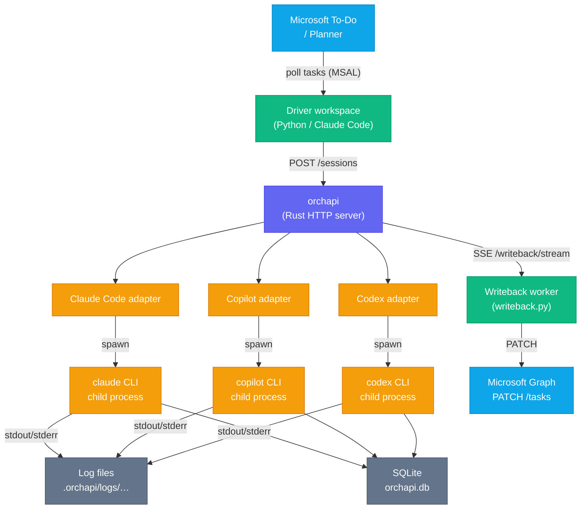

# Architecture

## Top-level system diagram

## Component descriptions

### orchapi server

orchapi is a single-binary Rust application built on **Axum** and **Tokio**. It exposes a JSON HTTP API on `127.0.0.1:7878` (configurable via `config.toml`). On each `POST /sessions` request the server resolves the final `SessionSpec` by merging config defaults, the selected profile, and any per-request overrides, then hands it off to the `SessionManager`.

The `SessionManager` owns two layers of `tokio::sync::Semaphore`: a global semaphore (default 4) and one per agent (default 2 each). A Tokio task is spawned immediately for each new session but blocks on semaphore acquisition before the child process is created. Once both permits are held, the appropriate adapter builds the CLI command, `tokio::process::Command` spawns the child, and two background tasks stream stdout and stderr to both a log file and a live broadcast channel (used for SSE).

### Driver workspace

The `driver/` directory is a Claude Code workspace — it runs inside a `claude` session, not as a standalone daemon. The `/poll-todos` slash command runs a single poll cycle: it calls `todo-poll/poll.py` to fetch pending Microsoft To-Do items, deduplicates them against `state/seen.sqlite`, routes each task to a profile via `todo-router/router.py` (or an LLM fallback), builds an `action_prompt`, and dispatches to orchapi via `orchapi-client/client.py`. The `/loop 5m /poll-todos` idiom keeps this cycling every five minutes.

The `todo-writeback/writeback.py` script is the reverse path: it subscribes to `GET /writeback/stream` (an SSE endpoint that fires whenever a session with an `external_task` reaches a terminal state) and PATCHes the corresponding Microsoft Graph task or Planner card with the outcome summary and status.

### Adapters

Each adapter is a small Rust struct implementing the `AgentAdapter` trait (`src/adapters/mod.rs`). The trait has two methods: `build_command` translates a `SessionSpec` into a `tokio::process::Command`, and `extract_outcome` parses the finished log to produce a summary string and optional usage JSON.

- **Claude adapter**: uses `claude --print --verbose --output-format stream-json --include-partial-messages`. Outcome is extracted by scanning for `{"type":"result"}` or `{"type":"assistant"}` JSON lines.
- **Copilot adapter**: uses `copilot --prompt … --allow-all-tools`. When a `system_prompt` and `agent_name` are both present, it writes a temporary JSON agent definition file. Outcome is the last non-empty log line.
- **Codex adapter**: uses `codex exec -m … -c instructions=… <action_prompt>`. The first `mcp_configs` entry is repurposed as the Codex `sandbox_mode`. Outcome is the last non-empty log line.

### Storage layer

All persistent state lives under `data_dir` (default `./.orchapi`). The SQLite database `orchapi.db` stores session records and structured events. Log files are written to `logs/YYYY/MM/DD/<session-id>.log`; each line is prefixed `[OUT] ` or `[ERR] ` to distinguish stdout from stderr. Migrations are embedded as static strings in `src/store.rs` and run idempotently on every startup.

## Startup sequence

1. Parse CLI flags (`--config` path, defaults to `config.toml`).
2. Load `AppConfig` from TOML; fall back to built-in defaults on parse error.
3. Create `data_dir` if it does not exist.
4. Load profile files from `profiles/*.toml` into a `ProfileStore`.
5. Open (or create) the SQLite database and run migrations.
6. Call `mark_running_as_cancelled`: any session still in `running` or `queued` state from a previous (crashed) run is marked `cancelled` with reason `server_startup`.
7. Create a `tokio::sync::broadcast::channel` for writeback signals.
8. Construct a `SessionManager` with the pool, config, and broadcast sender.
9. Build the Axum router, attach `AppState`, add `TraceLayer` and permissive `CorsLayer`.
10. Bind a `TcpListener` and call `axum::serve`.
