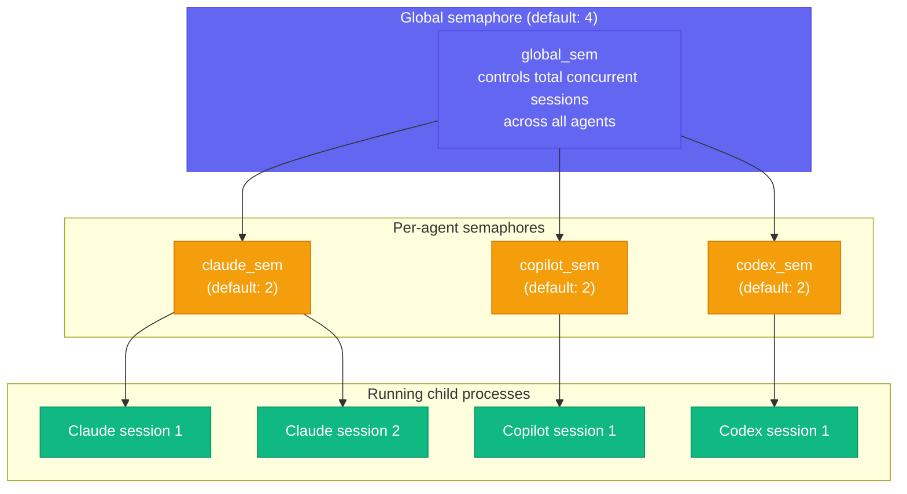

# Concurrency Model

## Two-semaphore hierarchy



A session must acquire **both** a global permit **and** an agent permit before its child process is spawned. This means:

- You cannot exceed `global` total concurrent sessions regardless of agent mix.
- You cannot exceed `claude` concurrent Claude sessions regardless of global capacity.
- The effective concurrency for any single agent is `min(global, agent_limit)`.

**Example**: `global=4`, `claude=2`, `copilot=2`, `codex=2`.
- Maximum simultaneous sessions: 4 total.
- Even if global has capacity, you can never run 3 Claude sessions at once.
- You could run 2 Claude + 2 Copilot = 4 total, hitting the global cap.

---

## How queuing works

orchapi uses Tokio async tasks, not OS threads or a work queue. The flow is:

1. `POST /sessions` is received synchronously on the Axum thread pool.
2. `manager.spawn_session(…)` inserts the DB row immediately (status=`queued`) and calls `tokio::spawn(run_session(…))`.
3. The HTTP response (`201 Created`) is returned **before** the task acquires any semaphore.
4. Inside `run_session`, the very first thing is:
   ```rust
   let global_permit = self.global_sem.clone().acquire_owned().await?;
   let agent_permit  = self.agent_sem(&spec.agent).clone().acquire_owned().await?;
   ```
5. If both semaphores have capacity, these `await`s return immediately and the child process spawns.
6. If either semaphore is at capacity, the task **suspends** (yields to the Tokio scheduler) with zero OS threads blocked. It resumes automatically when a permit is released.

This design means hundreds of sessions can be queued with negligible overhead — they are sleeping Tokio tasks waiting for a semaphore future to resolve.

---

## Config keys and defaults

Set in `config.toml` under `[concurrency]`:

| Key | Default | Effect |
|-----|---------|--------|
| `global` | `4` | Maximum total concurrent sessions (any agent) |
| `claude` | `2` | Maximum concurrent Claude sessions |
| `copilot` | `2` | Maximum concurrent Copilot sessions |
| `codex` | `2` | Maximum concurrent Codex sessions |

Zero values are normalised to the defaults (see `ConcurrencyConfig::normalized()` in `src/config.rs`).

**Example `config.toml` section**:

```toml
[concurrency]
global  = 6
claude  = 3
copilot = 2
codex   = 1
```

---

## What happens on cancel

`POST /sessions/:id/cancel` calls `manager.cancel(id)` which:

1. Reads the session row from the DB.
2. If status is neither `running` nor `queued`, returns 409.
3. Calls `store::set_finished` with `Outcome::cancelled(…)` — updates the DB immediately.

**v1 limitation**: The `SessionManager` does not retain a reference to the `Child` handle after spawning. The `run_session` Tokio task still holds it. When the DB is marked cancelled, the child process continues running; when it eventually exits, `run_session` calls `set_finished` a second time and may overwrite the `cancelled` status with `success` or `failed`.

The `kill_on_drop(true)` flag on the `Command` guarantees that when the `Child` handle is ultimately dropped (at end of `run_session`), the OS sends SIGKILL to the child if it has not yet exited. In practice, for short-lived sessions, the child often finishes before or shortly after the cancel request, and the second `set_finished` call is the authoritative terminal state.

A future version of the manager will store the `Child` in the live map alongside the broadcast sender, enabling explicit SIGTERM → wait → SIGKILL with the configurable `cancel_grace_seconds`.

---

## Permit release

Semaphore permits are held as `OwnedSemaphorePermit` values. They are released when dropped:

```rust
drop(global_permit);
drop(agent_permit);
drop(log_writer);
```

These three drops happen at the very end of `run_session`, after `set_finished` has updated the DB and the writeback signal (if any) has been sent. This ordering means a new session waiting on the semaphore will not start until the previous session's DB state is fully committed.

---

## Tips for tuning concurrency

**Rule of thumb for Claude**: Claude processes can use significant CPU and memory. Start with `claude=2` and monitor your machine's load with `top` or `htop`. Increase if you have spare cores and the processes are mostly waiting on API calls.

**Rule of thumb for Codex**: Codex sends requests to the OpenAI API. The bottleneck is usually the API rate limit, not your machine. Keep `codex=1` or `codex=2` to avoid rate limit errors.

**Rule of thumb for Copilot**: Similar to Claude — API-bound. `copilot=2` is a safe starting point.

**Global limit**: Set `global` to at most the number of CPU cores minus 2 (leave headroom for the server itself and your other work). On a 10-core machine, `global=6` is a reasonable ceiling.

**Memory**: Each Claude session can consume 200–500 MB of RAM depending on context size. If you see OOM kills, reduce `claude` or `global`.

**Monitoring**: The `/healthz` endpoint returns `counts.running` and `counts.queued` at a glance. The dashboard `/ui` shows the same counts in the header and refreshes every 2 seconds.

```bash
# watch running/queued counts
watch -n2 'curl -s http://127.0.0.1:7878/healthz | jq .counts'
```
