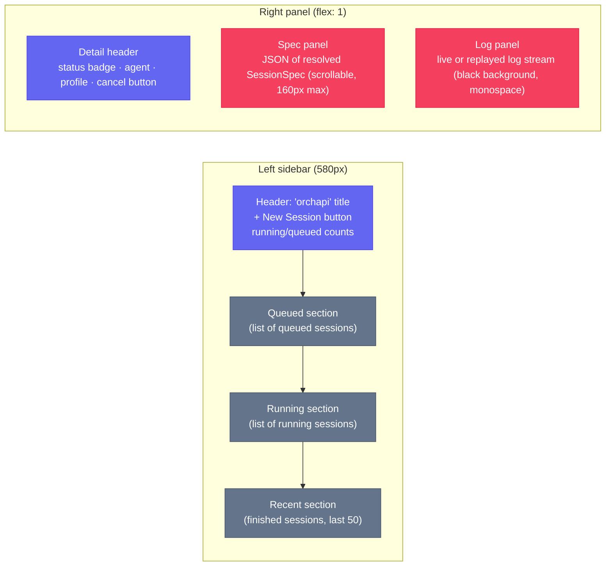

# Dashboard

The dashboard is a single-page application served at `GET /ui`. Open it in a browser while orchapi is running:

```
http://127.0.0.1:7878/ui
```

No installation needed — the HTML file is embedded in the server binary from `assets/index.html`.

---

## Layout overview



### Sidebar

The sidebar has three sections stacked vertically, each with a sticky section title:

- **Queued** — sessions with `status = "queued"` (shown in grey badge)
- **Running** — sessions with `status = "running"` (shown in green badge)
- **Recent** — all other sessions (success, failed, cancelled, timeout), newest first, capped at 50 rows

Each session row shows:
- Status badge (colour-coded)
- Agent name
- Profile name (if set)
- First 8 characters of the session UUID (right-aligned)
- `outcome_summary` or `action_prompt` as a truncated one-liner
- Relative timestamp (e.g. "2m ago")

The header also shows a compact `running: N  queued: N` count sourced from `/healthz`.

### Right panel

When no session is selected, the panel shows "Select a session to view details". Once a session is clicked:

- **Detail header**: status badge, agent, profile, and a red **Cancel** button (visible only when `status` is `running` or `queued`).
- **Session ID**: displayed in full below the title row.
- **Spec panel**: `JSON.stringify(session.spec, null, 2)` — the complete resolved `SessionSpec` at session creation time. Scrollable up to 160px.
- **Log panel**: monospace black background. Stdout lines are rendered in light grey (`log-out`), stderr lines in amber (`log-err`). Auto-scrolls to the bottom as new lines arrive.

---

## Selecting a session

Click any session row in the sidebar. The dashboard:

1. Closes any existing SSE connection.
2. Fetches `GET /sessions/:id` to display metadata and the spec JSON.
3. Opens a new `EventSource` at `GET /sessions/:id/stream`.
4. Appends `stdout` and `stderr` events to the log panel as they arrive.
5. On `outcome` event: closes the SSE connection, calls `refresh()` to update counts and the session list.

---

## Cancelling a session

Click the **Cancel** button in the detail header while a session is `running` or `queued`. The dashboard calls `POST /sessions/:id/cancel` and then immediately refreshes the session list.

---

## Creating a new session — the "+ New Session" modal

Click the **+ New Session** button in the sidebar header. A modal dialog opens with the following fields:

| Field | Input | Required | Notes |
|-------|-------|----------|-------|
| Agent | `<select>` | Yes | `Claude Code`, `GitHub Copilot`, `Codex` |
| Profile | `<select>` | No | Populated from `GET /profiles`; `— none —` is default |
| Action Prompt | `<textarea>` | Yes | The task instruction for the agent |
| System Prompt | `<textarea>` | No | Overrides or supplements the profile system prompt |
| Working Directory | `<input>` | No | Absolute path; falls back to profile/config default |
| Model | `<input>` | No | e.g. `sonnet`, `opus`, `o4-mini`; falls back to profile/config default |
| Tags | `<input>` | No | Comma-separated strings, e.g. `todo:abc, group:weekly` |

Clicking **Start Session** assembles a `POST /sessions` body from these fields and submits it. If `action_prompt` is empty the form shows an alert. On success the modal closes and the session list refreshes.

---

## Auto-refresh behavior

`setInterval(refresh, 2000)` runs every 2 seconds. Each tick:

1. Fetches `GET /sessions?limit=80` in parallel with `GET /healthz`.
2. Re-renders the three sidebar sections (queued, running, recent).
3. Updates the `running: N  queued: N` header count.

The currently selected session (if any) is highlighted with an `active` CSS class. The log panel is **not** re-fetched on refresh — it receives live updates via SSE.

---

## SSE log stream — live vs replay

The `EventSource` at `/sessions/:id/stream` behaves differently depending on whether the session is live:

**Live session** (status = `running`):
- The server has a `broadcast::Sender<LogLine>` registered in `manager.live`.
- Events are emitted in real-time as the child process writes to stdout/stderr.
- `event: stdout` and `event: stderr` events arrive as lines are produced.
- There is no `outcome` event until the child process exits.

**Finished session** (status = `success`, `failed`, `cancelled`, `timeout`):
- The server reads the log file from disk.
- All lines are emitted as a rapid sequence of SSE events.
- A final `event: outcome` with the status string is appended.
- The stream closes after the last event.

This means you can open the stream for a finished session and get a full replay of all output, in order, as SSE events — useful for post-mortems or building tools that process session output programmatically.

**Reconnect behavior**: The browser's `EventSource` API will attempt to reconnect automatically if the connection drops. For live sessions this is fine. For finished sessions the server will replay from the beginning on reconnect (the log file is always read from offset 0). The dashboard closes the `EventSource` on the `outcome` event to avoid spurious replays.
