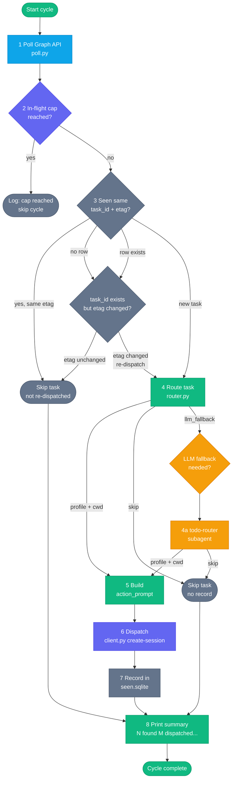

# Poll Cycle Deep-Dive

The poll cycle is the heart of the driver. Each run fetches every pending Microsoft To-Do task (plus linked Planner context), deduplicates against a local SQLite store, routes each new or changed task to an orchapi profile, dispatches a session, and records the result. The cycle is designed so that any single step can be observed, replayed, or debugged independently.

---

## Full poll cycle flowchart



---

## Step-by-step detail

### Step 1 — Poll Microsoft Graph

```bash
python3 .claude/skills/todo-poll/poll.py
```

Fetches every To-Do list, then for each list fetches tasks with `$filter=status ne 'completed'`. Uses `$expand=linkedResources` to detect Planner-linked tasks. If a task has a linked resource with `applicationName = "Microsoft Planner"`, it fetches the Planner task and its details and attaches them as the `planner` enrichment object.

Output is a JSON array written to stdout. Each element is a task item (see [Output schema](#output-schema) below).

If `state/token_cache.bin` is missing, the driver aborts the cycle and reminds you to run `poll.py --login`.

### Step 2 — Check the in-flight cap

```bash
python3 .claude/skills/orchapi-client/client.py count-running
```

Reads `[orchapi] max_in_flight` from `config/driver.toml` (default `4`). If the number of sessions currently in `running` or `queued` state is at or above the cap, the cycle logs `"in-flight cap reached, skipping dispatch this cycle"` and ends immediately. No tasks are marked as seen.

### Step 3 — Deduplicate against seen.sqlite

For each task in the poll output, the driver checks the `seen` table:

- **Same `task_id` + same `etag`** → already dispatched and not edited; skip.
- **Same `task_id`, different `etag`** → task was edited since last dispatch; re-dispatch.
- **No row** → new task; proceed to routing.

Tasks that are skipped here are not counted against `max_in_flight`; they simply don't produce a new session.

### Step 4 — Route

```bash
echo '<task-json>' | python3 .claude/skills/todo-router/router.py
```

Returns one of:

| Result | Meaning |
|---|---|
| `{"profile": "...", "cwd": "...", "overrides": {}}` | Match found — dispatch with this profile |
| `{"action": "skip"}` | Rule says skip — no session, no record |
| `{"action": "llm_fallback"}` | No rule matched — invoke `todo-router` subagent |

See [driver-router.md](driver-router.md) for routing rule syntax.

### Step 4a — LLM fallback (when needed)

1. `client.py list-profiles` — fetch the list of available profile names from orchapi.
2. Invoke the `todo-router` Claude Code subagent with the task JSON + profile list.
3. The subagent returns `{"profile": "...", "cwd": "..."}` or `{"action": "skip"}`.
4. If the subagent returns skip, the task is skipped and not recorded.

### Step 5 — Build action_prompt

The driver assembles the text prompt that the agent will receive as its instruction:

```
Task: <title>
List: <listName>
<body, if non-empty, truncated to 500 chars>
---
Source: Microsoft To-Do | Task ID: <id>
```

If `task.planner` is non-null, a Planner context block is appended after the `---` separator:

```
Planner: <plan_id> / <bucket_id>
Progress: <percent_complete>%   Priority: <priority>
Checklist:
- [x] Completed item
- [ ] Pending item
```

Checklist items are rendered in order; `[x]` for `isChecked: true`, `[ ]` for false. The Checklist line is omitted if the list is empty.

### Step 6 — Dispatch

```bash
python3 .claude/skills/orchapi-client/client.py create-session --spec '<json>'
```

The spec sent to `POST /sessions`:

```json
{
  "agent": "claude",
  "profile": "<from routing>",
  "overrides": {
    "action_prompt": "<built above>",
    "cwd": "<from routing>",
    "external_task": {
      "source": "<task.source>",
      "todo": {
        "list_id": "<task.listId>",
        "task_id": "<task.id>",
        "etag": "<task.etag>"
      },
      "planner": "<task.planner or null>"
    }
  }
}
```

`external_task` is always included so the writeback worker can PATCH Graph when the session finishes. If dispatch fails for a single task, the error is logged and the cycle continues to the next task.

### Step 7 — Record in seen.sqlite

```sql
INSERT OR REPLACE INTO seen VALUES (task_id, etag, list_id, dispatched_at, session_id, 'dispatched')
```

A task is only recorded after its session was successfully created. If dispatch fails, no row is inserted (so the task will be retried on the next cycle).

### Step 8 — Summary

```
Cycle complete: 12 found, 3 dispatched, 2 skipped, 7 already seen.
```

---

## In-flight cap

### What it is

`max_in_flight` (default `4`, set in `config/driver.toml [orchapi]`) is the maximum number of sessions that may be in `running` or `queued` state simultaneously. If the count is at or above this number when a poll cycle runs, the entire dispatch phase is skipped for that cycle.

### Why it matters

Agent CLI sessions consume significant resources: CPU, RAM, API budget, and tool call credits. Without a cap, a burst of new tasks could queue dozens of sessions simultaneously. The cap keeps the queue manageable and prevents runaway spend.

### How to tune it

| Scenario | Recommendation |
|---|---|
| Personal use, laptop | `max_in_flight = 2–4` |
| Workstation with dedicated API key | `max_in_flight = 6–8` |
| Shared API key with rate limits | `max_in_flight = 1–2` |

Edit `config/driver.toml`:

```toml
[orchapi]
max_in_flight = 4
```

The orchapi server has a separate `[concurrency]` setting in `config.toml` that limits how many sessions actually run at once (vs. queue). The driver cap and the server concurrency limit work independently: the driver won't even dispatch if `max_in_flight` is reached, even if the server has capacity.

---

## Deduplication

### seen.sqlite schema

```sql
CREATE TABLE IF NOT EXISTS seen (
    task_id      TEXT PRIMARY KEY,
    etag         TEXT,
    list_id      TEXT,
    dispatched_at INTEGER,   -- Unix timestamp
    session_id   TEXT,
    status       TEXT
)
```

The table is automatically created in `driver/state/seen.sqlite` the first time a cycle runs.

### Etag-based change detection

Microsoft Graph includes an `@odata.etag` on every To-Do task. The etag changes whenever the task body, title, due date, or any other field is modified. The driver stores the etag at dispatch time and compares it on subsequent polls:

- **Same etag** → no changes since dispatch; skip.
- **Changed etag** → task was edited; re-dispatch so the agent sees the updated content.

This means that editing a task in Microsoft To-Do (for example, adding more detail to the body) will cause it to be dispatched again on the next cycle. The new session runs independently of any previous one.

### TTL: forgetting old tasks

`[poll] dedupe_ttl_hours` in `config/driver.toml` (default `168`, i.e. 7 days). Tasks older than this TTL are not actively pruned by the driver itself — the TTL is informational context for how long you want deduplication to apply. To reset deduplication for all tasks, delete or truncate `state/seen.sqlite`.

```bash
rm driver/state/seen.sqlite
# The file will be recreated on the next cycle
```

---

## Planner enrichment

### When it fires

Planner enrichment is fetched during the poll step (step 1) for any To-Do task that has a linked resource with `applicationName = "Microsoft Planner"`. This happens automatically; no configuration is needed.

### What it adds

When Planner enrichment succeeds, the task item gains a `planner` object and `source` is set to `"planner"`. The enrichment object shape:

```json
{
  "task_id": "abc123",
  "etag": "W/\"...\"",
  "plan_id": "plan-xyz",
  "bucket_id": "bucket-abc",
  "percent_complete": 0,
  "priority": 5,
  "assignments": ["user-id-1", "user-id-2"],
  "details_etag": "W/\"...\"",
  "description": "Additional context from Planner task body",
  "checklist": [
    {"id": "item-1", "title": "Write tests", "isChecked": false},
    {"id": "item-2", "title": "Review PR", "isChecked": true}
  ],
  "web_url": "https://tasks.office.com/..."
}
```

### What it affects

- The `source` field is set to `"planner"`, enabling source-based routing rules.
- The action_prompt gains a Planner context block with progress percentage, priority, and checklist.
- The `external_task.planner` field is set in the dispatch spec, enabling the writeback worker to update the Planner task when the session finishes.

### Enrichment failure

If the Planner API call times out or returns an error (5-second timeout), enrichment is skipped for that task. A warning is printed to stderr, but the task is still dispatched as a plain To-Do task (without Planner context). `source` remains `"todo"`.

---

## Output schema

Full task item emitted by `poll.py`:

```json
{
  "id": "AAMkAGE1...",
  "listId": "AQMkADY0...",
  "listName": "Coding",
  "title": "Fix login bug",
  "body": "The OAuth flow breaks when the user has 2FA enabled...",
  "due": "2026-05-15T00:00:00.0000000",
  "importance": "normal",
  "status": "notStarted",
  "etag": "W/\"datetime'2026-05-09T14%3A00%3A00.000Z'\"",
  "lastModified": "2026-05-09T14:00:00Z",
  "source": "todo",
  "planner": null
}
```

With Planner enrichment:

```json
{
  "id": "AAMkAGE1...",
  "listId": "AQMkADY0...",
  "listName": "Work",
  "title": "Implement retry logic",
  "body": "See Planner board for details.",
  "due": "2026-05-20T00:00:00.0000000",
  "importance": "high",
  "status": "notStarted",
  "etag": "W/\"...\"",
  "lastModified": "2026-05-09T16:30:00Z",
  "source": "planner",
  "planner": {
    "task_id": "abc123",
    "etag": "W/\"...\"",
    "plan_id": "plan-xyz",
    "bucket_id": "bucket-abc",
    "percent_complete": 25,
    "priority": 3,
    "assignments": [],
    "details_etag": "W/\"...\"",
    "description": "Must handle 429 and 503 with exponential back-off.",
    "checklist": [
      {"id": "c1", "title": "Write unit tests", "isChecked": false}
    ],
    "web_url": "https://tasks.office.com/..."
  }
}
```

---

## PowerShell mode

### When to use it

PowerShell mode (`mode = "powershell"` in `config/driver.toml [graph]`) uses `Get-PendingTodos.ps1` instead of MSAL. Use it when:

- Your organisation's Entra ID tenant blocks the well-known public client ID used by MSAL mode.
- You already have a PowerShell-based Graph auth setup and want to reuse those credentials.
- Device-code flow is blocked by conditional access policies.

### How to switch

1. Open `config/driver.toml` and set `mode = "powershell"`.
2. Ensure `pwsh_script` points to the correct path (default: `../Get-PendingTodos.ps1`).
3. Make sure the script accepts `-Raw -Json` flags and outputs a JSON array. See `driver/README.md` for the exact modifications needed.

```toml
[graph]
mode = "powershell"
pwsh_script = "../Get-PendingTodos.ps1"
```

### Requirements

- PowerShell 7+ (`pwsh`)
- `Microsoft.Graph.Authentication` module: `Install-Module Microsoft.Graph.Authentication`
- `Get-PendingTodos.ps1` patched to accept `-Json` and emit JSON output

### Limitations

PowerShell mode does **not** fetch Planner enrichment. All tasks will have `"source": "todo"` and `"planner": null`, regardless of whether they are linked to Planner boards. If you need Planner context in your action prompts, use MSAL mode.
