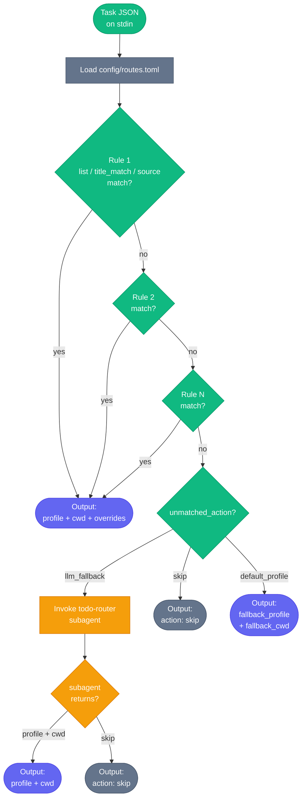

# Routing System

The router maps each incoming To-Do task to an orchapi session profile, a working directory, and optional overrides. It runs as a short-lived Python process that reads a task JSON object on stdin and writes a single JSON line to stdout. Routing is entirely rules-based by default; when no rule matches, the driver can fall back to LLM-assisted routing via a Claude Code subagent.

---

## Decision tree



---

## Route rule format

Rules are defined in `config/routes.toml` as an array of `[[routes]]` sections. Each section is one rule. All match keys are optional — omitting a key means "match anything for this field."

### Match keys

| Key | Type | Match semantics | Example |
|---|---|---|---|
| `list` | string | Exact match, case-insensitive, against `task.listName` | `list = "Coding"` |
| `title_match` | string | Python `re.search()` against `task.title` — partial match, supports flags inline | `title_match = "(?i)\\bPR\\b"` |
| `source` | string | Exact match against `task.source` (`"todo"` or `"planner"`) | `source = "planner"` |

### Output keys (on match)

| Key | Type | Required | Description |
|---|---|---|---|
| `profile` | string | Yes | orchapi profile name to use for the session |
| `cwd` | string | Yes | Absolute path to the working directory for the session |
| `overrides` | table | No | Additional session spec overrides (e.g. custom env vars) |

### Match semantics in detail

**`list` (exact, case-insensitive):** The rule's `list` value is compared to `task.listName` after both are lowercased. `list = "Coding"` matches tasks in lists named "coding", "CODING", or "Coding". It does not match "My Coding Tasks" — it must be an exact match on the full list name.

**`title_match` (Python `re.search`):** Uses Python's `re.search()`, which matches anywhere in the string (not just the beginning). Inline flags like `(?i)` for case-insensitivity work. Use double-backslash for regex metacharacters in TOML strings: `\\b` for a word boundary, `\\d` for a digit, etc.

**`source` (exact):** Matches the `task.source` field, which is either `"todo"` (plain To-Do task) or `"planner"` (task with Planner enrichment). Useful for routing Planner-linked tasks to a different profile.

### Priority: first match wins

Rules are evaluated top-to-bottom. The first rule whose match conditions are all satisfied is used. If a rule has both `list` and `title_match`, both must match. Place more-specific rules before less-specific ones.

---

## Default block

If no rule matches, the `[default]` block controls what happens:

```toml
[default]
unmatched_action = "llm_fallback"   # "llm_fallback" | "skip" | "default_profile"
fallback_profile = "example"
fallback_cwd = "/tmp"
```

| `unmatched_action` | Behaviour |
|---|---|
| `"llm_fallback"` | Invoke the `todo-router` Claude Code subagent. The subagent receives the task JSON + available profile names and returns a routing decision. |
| `"skip"` | Skip the task silently. No session is created and no row is inserted into `seen.sqlite`. The task will be re-evaluated on the next cycle. |
| `"default_profile"` | Use `fallback_profile` and `fallback_cwd` without LLM involvement. Good for "dispatch everything that isn't explicitly skipped." |

If `routes.toml` does not exist, all tasks are treated as if `unmatched_action = "llm_fallback"`.

---

## LLM fallback

### What the subagent receives

The `todo-router` subagent (`.claude/agents/todo-router.md`) is invoked with:

- The full task JSON object (all fields from the poll output, including Planner enrichment if present).
- A list of available orchapi profile names fetched from `client.py list-profiles`.

### What it returns

The subagent must return exactly one line of valid JSON — nothing before or after:

```json
{"profile": "default", "cwd": "/Users/you/dev/myproject"}
```

or:

```json
{"action": "skip"}
```

### When it skips

The subagent is instructed to prefer `skip` over a bad guess. It will skip tasks that look like:

- Reminders or recurring chores ("Call dentist", "Take out bins")
- Calendar notes or meeting summaries
- Tasks with no clear engineering action
- Tasks where no available profile is a good fit

### Using it wisely

LLM fallback consumes API tokens on every unmatched task. If you find that the subagent is being invoked frequently, consider:

1. Adding more explicit rules to `routes.toml` for your common task patterns.
2. Switching `unmatched_action` to `"skip"` or `"default_profile"` if you trust the fallback profile for most tasks.

---

## Example routes.toml

```toml
# config/routes.toml
# Rules are evaluated top-to-bottom; the first match wins.
# Both `list` and `title_match` are optional — omit either to match all values.

# -----------------------------------------------------------------------
# Explicit list routing
# -----------------------------------------------------------------------

# All tasks in the "Coding" list go to the default profile in your dev dir
[[routes]]
list = "Coding"
profile = "default"
cwd = "/Users/you/dev/myproject"

# Tasks in "Work" → a second profile and working directory
[[routes]]
list = "Work"
profile = "work-agent"
cwd = "/Users/you/dev/work"

# -----------------------------------------------------------------------
# Title-based routing (more specific — place before broad list rules)
# -----------------------------------------------------------------------

# PR review tasks from any list → pr-reviewer profile
# title_match uses Python re.search — (?i) makes it case-insensitive
[[routes]]
title_match = "(?i)\\bPR\\b|pull request"
profile = "pr-reviewer"
cwd = "/Users/you/dev/myproject"

# Deploy-related tasks in the Work list → infra profile
[[routes]]
list = "Work"
title_match = "(?i)deploy|rollout|release"
profile = "infra"
cwd = "/Users/you/infra"

# -----------------------------------------------------------------------
# Source-based routing (Planner vs plain To-Do)
# -----------------------------------------------------------------------

# Planner-linked tasks from any list → a team profile
[[routes]]
source = "planner"
profile = "team-agent"
cwd = "/Users/you/dev/team-project"

# -----------------------------------------------------------------------
# Skip rules — explicitly opt-out tasks before broader rules fire
# -----------------------------------------------------------------------

# Skip tasks in the "Personal" list entirely
# [[routes]]
# list = "Personal"
# profile = "skip"     ← not valid; use action key instead

# NOTE: to skip a list, use a rule with title_match = ".*" and
# unmatched_action = "skip" in [default], OR add it as a named route
# and filter it out in a pre-processing step. The cleanest approach is
# a dedicated list that maps to a "skip" rule using a catch-all:
#
# [[routes]]
# list = "Personal"
# profile = "default"       # won't be used — driver checks action key
# cwd = "/tmp"
#
# For a true skip-on-list, set unmatched_action = "skip" and place
# your non-personal lists above it.

# -----------------------------------------------------------------------
# Fallback behaviour for unmatched tasks
# -----------------------------------------------------------------------
[default]
unmatched_action = "llm_fallback"   # "llm_fallback" | "skip" | "default_profile"
fallback_profile = "default"
fallback_cwd = "/Users/you/dev/myproject"
```

---

## Running the router directly

You can pipe any task JSON to the router script for testing:

```bash
echo '{
  "id": "AAMk...",
  "listId": "AQMk...",
  "listName": "Coding",
  "title": "Fix login bug",
  "body": "",
  "source": "todo",
  "planner": null
}' | python3 .claude/skills/todo-router/router.py
```

Expected output (with the example routes above):

```json
{"profile": "default", "cwd": "/Users/you/dev/myproject", "overrides": {}, "source": "todo", "planner": null}
```

If `routes.toml` is missing or unreadable, all tasks return `{"action": "llm_fallback"}`.
