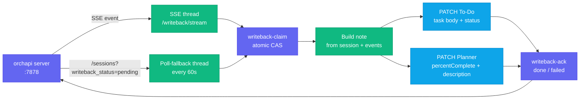

# Writeback System

The writeback worker closes the loop between orchapi and Microsoft Graph. When an agent session reaches a terminal state (success, failed, or cancelled), the worker automatically patches the originating To-Do task: it appends an outcome note to the task body and, on success, marks the task as completed. For Planner-linked tasks, it also updates the Planner task's `percentComplete` and appends the note to the Planner task's description.

---

## What writeback does

1. **Marks To-Do tasks complete** — on a successful session, sets `status = "completed"` on the originating Microsoft To-Do task.
2. **Appends an outcome note** — regardless of outcome, sets the task body to a structured note containing the session ID, final status, outcome summary, and key event text.
3. **Updates Planner tasks** — for tasks linked to Microsoft Planner, sets `percentComplete = 100` on success and appends the same note to the Planner task's description field.

### Component overview



---

## Sequence diagram

```mermaid
sequenceDiagram
    participant ORC as orchapi server
    participant WB as writeback.py
    participant GR as Microsoft Graph

    Note over ORC,WB: Session reaches terminal state
    ORC-)WB: SSE: data: {"session_id": "abc"}
    WB->>ORC: POST /sessions/abc/writeback-claim
    ORC-->>WB: 200 {"ok": true}
    Note over ORC,WB: (409 if already claimed — skip)

    WB->>ORC: GET /sessions/abc
    ORC-->>WB: session JSON (status, outcome_summary, external_task)

    WB->>ORC: GET /sessions/abc/events
    ORC-->>WB: events array

    Note over WB: Build note text from session + events

    WB->>GR: PATCH /me/todo/lists/{list_id}/tasks/{task_id}
    Note over WB,GR: body = note text; status = "completed" if success
    GR-->>WB: 200 (or 412 → re-GET etag → retry)

    alt task has Planner link
        WB->>GR: PATCH /planner/tasks/{task_id}
        Note over WB,GR: percentComplete = 100 (success only)
        GR-->>WB: 200 (or 412 → retry)

        WB->>GR: GET /planner/tasks/{task_id}/details
        GR-->>WB: current description + fresh etag
        WB->>GR: PATCH /planner/tasks/{task_id}/details
        Note over WB,GR: description = existing + "\n\n" + note
        GR-->>WB: 200
    end

    WB->>ORC: POST /sessions/abc/writeback-ack
    Note over WB,ORC: {"result": "done"} or {"result": "failed", "error": "..."}
    ORC-->>WB: 200
```

---

## The external_task field

Every session dispatched by the driver includes an `external_task` object in its spec. This is what gives the writeback worker enough information to patch Graph.

### Shape

```json
{
  "source": "todo",
  "todo": {
    "list_id": "AQMkADY0...",
    "task_id": "AAMkAGE1...",
    "etag": "W/\"datetime'2026-05-09T14%3A00%3A00.000Z'\""
  },
  "planner": null
}
```

With a Planner-linked task:

```json
{
  "source": "planner",
  "todo": {
    "list_id": "AQMkADY0...",
    "task_id": "AAMkAGE1...",
    "etag": "W/\"...\""
  },
  "planner": {
    "task_id": "abc123",
    "etag": "W/\"...\"",
    "plan_id": "plan-xyz",
    "bucket_id": "bucket-abc",
    "percent_complete": 25,
    "priority": 3,
    "assignments": [],
    "details_etag": "W/\"...\"",
    "description": "...",
    "checklist": [],
    "web_url": "https://tasks.office.com/..."
  }
}
```

The `external_task` field is stored in the orchapi SQLite database as part of the session record and is returned by `GET /sessions/:id`.

---

## Claim / ack protocol

### Why it exists

The writeback worker runs two concurrent threads: an SSE thread and a poll-fallback thread. Both can discover the same session independently (e.g., the SSE fires but the session is also returned by the fallback poll before the SSE work completes). The claim/ack protocol prevents double-writes via an atomic compare-and-swap on the server side.

### Claim

```
POST /sessions/:id/writeback-claim
```

orchapi atomically transitions the session's `writeback_status` from `pending` to `in_progress`. If the session is already `in_progress` or `done`, the server returns **409 Conflict**. The writeback worker checks for this and skips the session silently — another invocation (or the same one from the other thread) is handling it.

### Ack

After all Graph PATCHes are complete (or on failure), the worker posts an ack:

```
POST /sessions/:id/writeback-ack
```

```json
{"result": "done"}
```

or on failure:

```json
{"result": "failed", "error": "HTTP 403: Insufficient permissions"}
```

The ack sets `writeback_status` to `done` (or `failed`), which removes the session from the `?writeback_status=pending` query used by the poll-fallback thread.

---

## Note text format

The note written to the To-Do task body (and appended to the Planner description) is:

```
orchapi session abc123 — success
Outcome: Implemented the retry logic with exponential back-off.
Notes:
  • Created RetryHandler class in src/http.rs
  • Added unit tests for 429 and 503 responses
  • Updated README with configuration options
```

Fields:
- First line: `orchapi session <id> — <status>` — always present.
- `Outcome:` — the session's `outcome_summary` field (may be empty if the agent didn't set one).
- `Notes:` section — one bullet per event with a non-empty `text` field from the session's events log. Omitted if no text events exist.

---

## 412 etag-refresh handling

Microsoft Graph uses optimistic concurrency for PATCH operations. Every PATCH request must include an `If-Match: <etag>` header. If the resource has been modified since the etag was captured (e.g., the user edited the task while the session was running), Graph returns **412 Precondition Failed**.

The writeback worker handles this automatically:

1. On 412, immediately re-GET the resource to obtain the current etag.
2. Retry the PATCH once with the fresh etag.

If the retry also fails (e.g., a second concurrent modification), the error propagates and is reported in the writeback-ack as `"failed"`.

This logic is implemented in `_graph_patch()` in `writeback.py`:

```python
except urllib.error.HTTPError as exc:
    if exc.code == 412:
        fresh = _graph_get_timeout(token, url)
        fresh_etag = fresh.get("@odata.etag", etag)
        # retry with fresh_etag
```

---

## Poll-fallback thread

### Why it exists

The SSE connection (`/writeback/stream`) is a long-lived HTTP connection. Network interruptions, server restarts, or proxy timeouts can silently drop the connection. Sessions that reached terminal state during the gap would never be processed if the worker relied solely on SSE.

The poll-fallback thread queries `GET /sessions?writeback_status=pending` every `poll_fallback_seconds` (default 60) and processes any sessions it finds. Combined with the claim/ack protocol, this ensures at-least-once delivery without double-writes.

### Configuration

```toml
[writeback]
poll_fallback_seconds = 60   # how often to poll for missed sessions
```

---

## What gets updated in Graph

| Event | To-Do task | Planner task | Planner details |
|---|---|---|---|
| Session `success` | `body` = note; `status = "completed"` | `percentComplete = 100` | `description` += note |
| Session `failed` | `body` = note | (no change) | `description` += note |
| Session `cancelled` | `body` = note | (no change) | `description` += note |

Notes:
- The To-Do body update always happens, regardless of outcome.
- The Planner `percentComplete` is only set to 100 on success.
- The Planner description append always happens (for any terminal state) as a record of what occurred.
- All PATCHes use `If-Match` with the etag stored at dispatch time, with automatic retry on 412.

---

## Starting the writeback worker

Run the `/writeback-loop` slash command inside a Claude Code session opened in `driver/`:

```
/writeback-loop
```

This runs:

```bash
python3 .claude/skills/todo-writeback/writeback.py
```

The worker prints `writeback worker started (SSE + poll fallback)` to stderr and runs until interrupted (Ctrl-C). It does not daemonize.

To run it outside of Claude Code:

```bash
cd /path/to/orchapi/driver
source .venv/bin/activate
python3 .claude/skills/todo-writeback/writeback.py
```

### Prerequisites

- `state/token_cache.bin` must exist and contain `Tasks.ReadWrite` + `Group.ReadWrite.All` scopes.
- If the cache is missing or was created with narrower scopes, run `python3 .claude/skills/todo-poll/poll.py --login` to re-authenticate.
- `writeback.enabled = true` in `config/driver.toml` (the default).

---

## Known limitation: token acquired once at startup

The MSAL token is acquired once when the worker starts. Access tokens expire after approximately one hour. The `msal` library handles silent refresh automatically using the refresh token stored in the cache — **but only if the `PublicClientApplication` instance persists**, which it does for the lifetime of the process.

In practice this means the worker can run indefinitely without re-authentication as long as the refresh token remains valid (refresh tokens are valid for 90 days for personal MSA accounts, and up to 90 days for work/school accounts depending on tenant policy).

If the worker logs `Auth error: no accounts in cache` or starts returning 401 responses from Graph:

1. Stop the worker (Ctrl-C).
2. Delete `state/token_cache.bin`.
3. Re-authenticate: `python3 .claude/skills/todo-poll/poll.py --login`.
4. Restart the worker.

There is no automatic restart on 401; the worker must be restarted manually.
