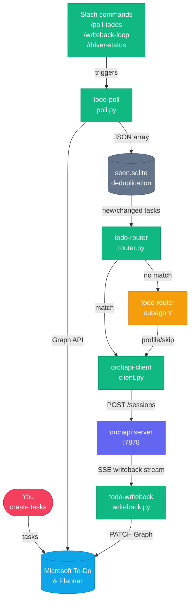

# orchapi Driver

The orchapi driver is a Python workspace that turns your Microsoft To-Do and Planner boards into a hands-free AI dispatch loop. You open it in Claude Code once, run `/loop 5m /poll-todos`, and walk away: pending tasks are fetched from Microsoft Graph, matched to orchapi session profiles, and dispatched to the local server — which spawns Claude Code, Copilot CLI, or Codex to work on each one. When a session finishes, the writeback worker patches the original task back in Microsoft Graph, marking it complete and appending an outcome note.

The driver itself is Claude Code — not a daemon or a compiled binary. It is a project workspace (a directory with `.claude/` configuration) that you open with `claude --cwd driver/`. This means every step of the cycle is transparent, auditable, and editable: the poll cycle is defined in plain English in `CLAUDE.md`, skills are regular Python scripts you can run directly, and routing rules are a TOML file you can edit without restarting anything.

---

## Directory layout

```
driver/
├── .claude/
│   ├── CLAUDE.md                        # Poll cycle definition (authoritative)
│   ├── agents/
│   │   └── todo-router.md               # LLM fallback routing subagent
│   ├── commands/
│   │   ├── poll-todos.md                # /poll-todos slash command
│   │   ├── driver-status.md             # /driver-status slash command
│   │   └── writeback-loop.md            # /writeback-loop slash command
│   ├── settings.local.json              # Driver-specific Claude Code settings
│   └── skills/
│       ├── _lib/
│       │   ├── __init__.py
│       │   └── graph_auth.py            # Shared MSAL device-code auth helper
│       ├── orchapi-client/
│       │   ├── client.py                # CLI wrapper for the orchapi REST API
│       │   └── SKILL.md
│       ├── todo-poll/
│       │   ├── poll.py                  # MS Graph poll (MSAL + PowerShell modes)
│       │   └── SKILL.md
│       ├── todo-router/
│       │   ├── router.py                # Rules-based TOML router
│       │   └── SKILL.md
│       └── todo-writeback/
│           ├── writeback.py             # Long-running SSE writeback daemon
│           └── SKILL.md
├── config/
│   ├── driver.toml                      # Runtime configuration (copy from .example)
│   ├── driver.toml.example              # Annotated template
│   └── routes.toml.example             # Routing rules template
├── state/
│   ├── seen.sqlite                      # Deduplication database (auto-created)
│   └── token_cache.bin                  # MSAL token cache (gitignored)
├── requirements.txt                     # Python dependencies (msal, tomli)
└── README.md
```

---

## Slash commands

These commands are invoked inside a Claude Code session opened in `driver/`. They are defined as `.claude/commands/*.md` files and delegate to the steps documented in `CLAUDE.md`.

| Command | Description |
|---|---|
| `/poll-todos` | Run one full poll → dedupe → route → dispatch → record cycle. Reports `N found, M dispatched, K skipped, J already seen.` |
| `/driver-status` | Show the 20 most-recently dispatched tasks and their current orchapi session status (running / queued / success / failed). |
| `/writeback-loop` | Start `writeback.py` in the foreground. Subscribes to the orchapi SSE writeback stream and PATCHes Microsoft Graph when sessions reach a terminal state. |

---

## Skills reference

Skills are Python scripts invoked by Claude Code as part of the poll cycle. They can also be run directly from the shell for debugging.

| Skill | Entry point | What it does |
|---|---|---|
| `todo-poll` | `.claude/skills/todo-poll/poll.py` | Authenticates with Microsoft Graph (MSAL or PowerShell) and emits a JSON array of pending To-Do tasks, optionally enriched with Planner metadata. Pass `--login` to force a device-code re-authentication. |
| `todo-router` | `.claude/skills/todo-router/router.py` | Reads a task JSON object from stdin and matches it against `config/routes.toml`. Outputs one JSON line: `{profile, cwd, overrides}`, `{action: "skip"}`, or `{action: "llm_fallback"}`. |
| `todo-writeback` | `.claude/skills/todo-writeback/writeback.py` | Long-running daemon. Two threads: one subscribes to the orchapi SSE writeback stream, the other polls `/sessions?writeback_status=pending` every 60 seconds as a fallback. On each signal, claims the writeback, builds a note, and PATCHes Microsoft Graph. |
| `orchapi-client` | `.claude/skills/orchapi-client/client.py` | Thin CLI wrapper around the orchapi REST API. Supports `list-profiles`, `create-session`, `get-session`, `list-sessions`, `count-running`, `post-event`, `ack-writeback`, `list-pending-writeback`. |
| `_lib/graph_auth` | `.claude/skills/_lib/graph_auth.py` | Shared MSAL device-code auth helper. Used by both `poll.py` and `writeback.py`. Manages token cache at `state/token_cache.bin`. |

---

## Subagent: todo-router

**Location:** `.claude/agents/todo-router.md`

The `todo-router` subagent is the LLM fallback for tasks that don't match any rule in `routes.toml`. When the rules-based router returns `{action: "llm_fallback"}`, the driver:

1. Calls `client.py list-profiles` to get the set of available orchapi profile names.
2. Invokes the `todo-router` subagent with the full task JSON plus the profile list.
3. The subagent returns exactly one JSON line: `{"profile": "<name>", "cwd": "<path>"}` or `{"action": "skip"}`.

The subagent is instructed to skip tasks that look like reminders, recurring chores, or calendar notes — anything without a clear engineering action. It prefers `skip` over a bad guess because incorrectly dispatched sessions waste budget.

---

## How to start the driver

The driver is a Claude Code workspace. You don't run a script — you open Claude Code in the `driver/` directory:

```bash
claude --cwd /path/to/orchapi/driver
```

If you installed via `install.sh` to the default location:

```bash
claude --cwd ~/.local/share/orchapi/driver
```

On first run, make sure you have authenticated with Microsoft Graph and that `state/token_cache.bin` exists. If not, exit and run:

```bash
cd /path/to/orchapi/driver
source .venv/bin/activate
python3 .claude/skills/todo-poll/poll.py --login
```

---

## Typical workflow

The recommended startup sequence after the one-time setup is complete:

**Terminal 1 — orchapi server:**
```bash
orchapi
# orchapi listening on http://127.0.0.1:7878
```

**Terminal 2 — driver (Claude Code):**
```bash
claude --cwd /path/to/orchapi/driver
```

Inside the Claude Code session:
```
/loop 5m /poll-todos
```

This starts the recurring poll loop. Every 5 minutes, Claude Code will execute a full cycle: poll Microsoft Graph, deduplicate against `seen.sqlite`, route each new task, and dispatch sessions to orchapi.

**Terminal 2 (same Claude Code session, or a second one):**
```
/writeback-loop
```

This starts the writeback worker in the foreground. It subscribes to the orchapi SSE stream and watches for sessions reaching a terminal state (success / failed / cancelled). When one fires, it PATCHes the source task in Microsoft Graph to mark it complete and append the outcome summary as a note.

You can run the poll loop and the writeback worker in the same Claude Code session by starting `writeback-loop` first (it blocks), then opening a second Claude Code window for the poll loop. Alternatively, run `/writeback-loop` in a background task using Claude Code's task tools.

---

## Component flowchart



---

## Configuration quick-reference

| File | Purpose |
|---|---|
| `config/driver.toml` | Cadence, orchapi URL, MSAL settings, `max_in_flight` cap |
| `config/routes.toml` | Routing rules (copy from `routes.toml.example`, then edit) |
| `state/seen.sqlite` | Deduplication store — auto-created on first cycle |
| `state/token_cache.bin` | MSAL token cache — created by `poll.py --login` |

See [driver-poll.md](driver-poll.md) for the full poll cycle, [driver-router.md](driver-router.md) for routing rules, [driver-writeback.md](driver-writeback.md) for the writeback system, and [microsoft-graph.md](microsoft-graph.md) for Graph authentication.
