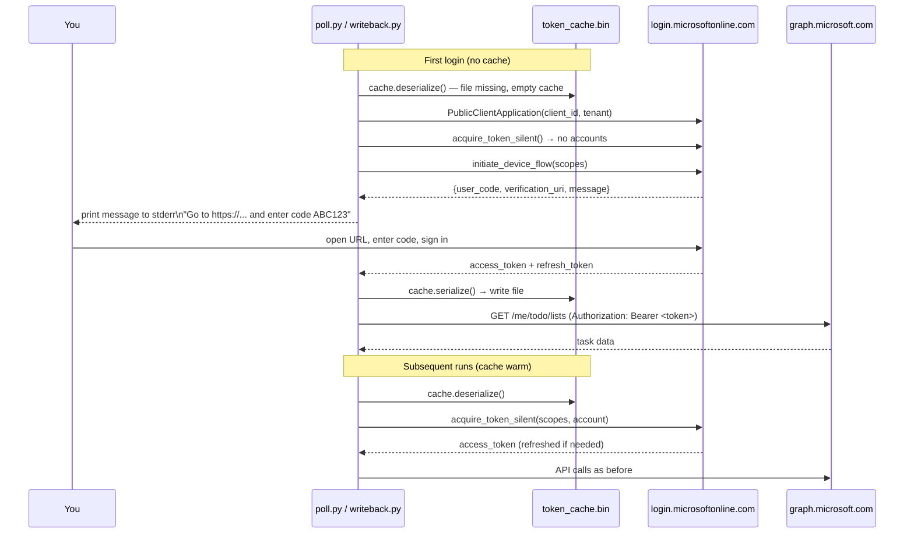

# Microsoft Graph Integration Guide

orchapi's driver communicates with Microsoft Graph to read To-Do and Planner tasks (poll) and to write back results when sessions complete (writeback). Authentication is handled via MSAL device-code flow. This document covers everything you need to know to set up, maintain, and troubleshoot Graph authentication.

---

## MSAL device-code auth flow



### Silent refresh

After the first login, `acquire_token_silent()` uses the cached refresh token to obtain a new access token without user interaction. This happens transparently on every run. The refresh token is valid for up to 90 days; after that, you must re-authenticate with `--login`.

---

## Required scopes

| Scope | Why it is needed |
|---|---|
| `Tasks.ReadWrite` | Read To-Do lists and tasks during the poll; mark tasks as `completed` and update the task body during writeback. |
| `Group.ReadWrite.All` | Read Planner tasks and their details during Planner enrichment; update `percentComplete` and `description` on writeback. Planner tasks are associated with Microsoft 365 Groups, which require this scope. |

Both scopes are requested together during the device-code flow. They are set in `config/driver.toml`:

```toml
[graph]
scopes = ["Tasks.ReadWrite", "Group.ReadWrite.All"]
```

### Scope upgrade

If you previously authenticated with only `Tasks.Read` or `Tasks.ReadWrite` (without `Group.ReadWrite.All`), the cached token will not have the Group scope. The Planner writeback PATCH calls will return 403 Forbidden.

To re-authenticate with the full scope set:

```bash
rm driver/state/token_cache.bin
python3 .claude/skills/todo-poll/poll.py --login
```

The driver will initiate a new device-code flow requesting all configured scopes.

---

## Client ID

The default `client_id` in `config/driver.toml` is:

```
14d82eec-204b-4c2f-b7e8-296a70dab67e
```

This is Microsoft's well-known public MSAL client ID. It works for:

- **Personal Microsoft accounts (MSA)** — outlook.com, hotmail.com, live.com, etc.
- **Work/school accounts (Entra ID)** — most commercial tenants allow it by default.

### When to register your own app

Register your own Entra ID application if:

- Your organisation's tenant has disabled or restricted use of the well-known public client.
- Your IT department requires all OAuth applications to be explicitly registered and approved.
- You want to restrict the app's permissions to a specific set of users.

**How to register:**

1. Open [portal.azure.com](https://portal.azure.com) → Azure Active Directory → App registrations → New registration.
2. Name: "orchapi driver" (or anything you like). Supported account types: "Accounts in any organizational directory and personal Microsoft accounts" (or restrict to your tenant only).
3. Redirect URI: Leave blank for public client apps.
4. After creation: Authentication → Advanced settings → "Allow public client flows" → Yes.
5. API permissions → Add: Microsoft Graph → Delegated → `Tasks.ReadWrite`, `Group.ReadWrite.All` → Grant admin consent (if required by your org).
6. Copy the Application (client) ID from the Overview page.
7. Set `client_id` in `config/driver.toml`.

---

## Tenant configuration

The `tenant` value in `config/driver.toml` controls which Microsoft identity provider endpoint is used:

| Value | Description |
|---|---|
| `"common"` | Accepts both personal MSA accounts and work/school Entra ID accounts. Use this for personal setups or when you have both types of accounts. |
| `"consumers"` | Personal MSA accounts only (outlook.com, hotmail.com, live.com). |
| `"organizations"` | Work/school Entra ID accounts only. |
| `"<tenant-id>"` | A specific Entra ID tenant (GUID or `.onmicrosoft.com` domain). Use when your org's conditional access policies require it, or when you want to lock the app to a single tenant. |

```toml
[graph]
tenant = "common"
# or: tenant = "contoso.onmicrosoft.com"
# or: tenant = "11111111-2222-3333-4444-555555555555"
```

---

## Token cache

### What it is

The token cache (`state/token_cache.bin`) is a JSON-serialized MSAL `SerializableTokenCache`. It stores:

- Access tokens (short-lived, ~1 hour)
- Refresh tokens (long-lived, up to 90 days)
- Account metadata (account ID, username, tenant)

### Where it lives

Default path: `driver/state/token_cache.bin` (relative to the driver root). Override in `config/driver.toml`:

```toml
[graph]
token_cache_path = "./state/token_cache.bin"
```

The file is listed in `driver/.gitignore` and must never be committed to version control.

### How to re-authenticate

```bash
cd /path/to/orchapi/driver
source .venv/bin/activate
python3 .claude/skills/todo-poll/poll.py --login
```

The `--login` flag forces `acquire_token_by_device_flow()` even if a cached account exists. Use it when:

- The refresh token has expired (>90 days since last login).
- You switched Microsoft accounts.
- You upgraded scopes and need to re-consent.
- The cache file is corrupt or missing.

To re-authenticate from scratch:

```bash
rm driver/state/token_cache.bin
python3 .claude/skills/todo-poll/poll.py --login
```

---

## PowerShell fallback mode

### How to switch

In `config/driver.toml`, set `mode = "powershell"`:

```toml
[graph]
mode = "powershell"
pwsh_script = "../Get-PendingTodos.ps1"
```

In PowerShell mode, `poll.py` calls `Get-PendingTodos.ps1 -Raw -Json` using `pwsh`. Authentication is handled entirely by the PowerShell script using the `Microsoft.Graph.Authentication` module — MSAL is not used.

### Requirements

| Requirement | Notes |
|---|---|
| PowerShell 7+ | Install from [github.com/PowerShell/PowerShell/releases](https://github.com/PowerShell/PowerShell/releases) |
| `Microsoft.Graph.Authentication` module | `Install-Module Microsoft.Graph.Authentication` |
| `Get-PendingTodos.ps1` patched | Must accept `-Json` flag and output JSON array (see `driver/README.md`) |

### Limitations

- **No Planner enrichment.** PowerShell mode does not fetch Planner task details. All tasks will have `"source": "todo"` and `"planner": null`, so Planner writeback will not occur.
- **No `--login` flag support.** Authentication in PowerShell mode is handled by the PS1 script and `Connect-MgGraph`. Run `Connect-MgGraph` interactively outside of the driver when you need to re-authenticate.
- **Token cache is not shared.** The MSAL cache at `state/token_cache.bin` is not used in PowerShell mode.

---

## Graph endpoints used

### Poll (read)

| Method | Endpoint | Purpose |
|---|---|---|
| `GET` | `/me/todo/lists?$top=100` | Fetch all To-Do lists (paginated) |
| `GET` | `/me/todo/lists/{listId}/tasks?$filter=status ne 'completed'&$expand=linkedResources` | Fetch pending tasks with linked resources |
| `GET` | `/planner/tasks/{taskId}` | Fetch Planner task (Planner enrichment) |
| `GET` | `/planner/tasks/{taskId}/details` | Fetch Planner task details + checklist |

### Writeback (read + write)

| Method | Endpoint | Purpose |
|---|---|---|
| `PATCH` | `/me/todo/lists/{listId}/tasks/{taskId}` | Update task body and/or status |
| `PATCH` | `/planner/tasks/{taskId}` | Update `percentComplete` |
| `GET` | `/planner/tasks/{taskId}/details` | Fetch current description + fresh etag before append |
| `PATCH` | `/planner/tasks/{taskId}/details` | Append outcome note to description |

All requests are made to `https://graph.microsoft.com/v1.0/`. PATCH requests include `If-Match: <etag>` for optimistic concurrency; a 412 response triggers an automatic etag refresh and retry.

---

## Graph integration overview

```mermaid
flowchart TD
    POLL[poll.py\nMSAL mode]:::drv
    PS[poll.py\nPowerShell mode]:::drv
    AUTH[graph_auth.py\nMSAL device-code]:::drv
    CACHE[(token_cache.bin)]:::sto
    LOGIN[login.microsoftonline.com]:::gph
    GRAPH[graph.microsoft.com/v1.0]:::gph
    TODO[/me/todo/lists\n/tasks]:::gph
    PLANNER[/planner/tasks\n/details]:::gph
    WB[writeback.py]:::drv

    POLL -->|get_token| AUTH
    WB -->|get_token| AUTH
    AUTH -->|deserialize| CACHE
    AUTH -->|acquire_token_silent\nor device_flow| LOGIN
    LOGIN -->|access_token| AUTH
    AUTH -->|serialize| CACHE
    POLL -->|GET lists + tasks| TODO
    POLL -->|GET planner enrichment| PLANNER
    WB -->|PATCH body + status| TODO
    WB -->|PATCH percentComplete| PLANNER
    WB -->|PATCH description| PLANNER
    PS -.->|pwsh Get-PendingTodos.ps1\nno Planner enrichment| TODO

    TODO --> GRAPH
    PLANNER --> GRAPH

    classDef srv fill:#6366f1,stroke:#4f46e5,color:#fff
    classDef drv fill:#10b981,stroke:#059669,color:#fff
    classDef gph fill:#0ea5e9,stroke:#0284c7,color:#fff
    classDef agt fill:#f59e0b,stroke:#d97706,color:#fff
    classDef sto fill:#64748b,stroke:#475569,color:#fff
    classDef usr fill:#f43f5e,stroke:#e11d48,color:#fff
```
