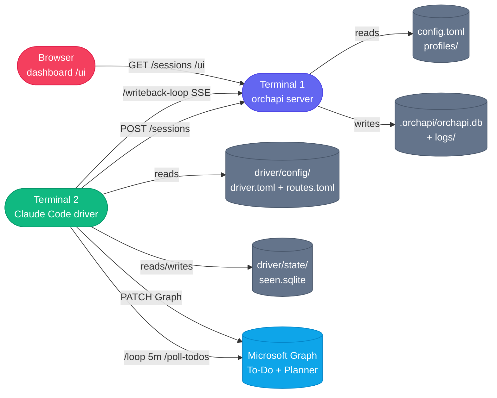

# Operations Guide

This guide covers starting and running orchapi in day-to-day use: launching the server, configuring log levels, using the dashboard, querying the API, managing sessions, and running the driver.

---

## Starting the server

### Via the launcher (recommended)

If installed via `install.sh`, the `orchapi` launcher is at `~/.local/bin/orchapi`. It `cd`s into the install root before exec-ing the binary, ensuring that `profiles/` is found relative to the working directory:

```bash
orchapi
# orchapi listening on http://127.0.0.1:7878
# Dashboard: http://127.0.0.1:7878/ui
```

### Via cargo run (development)

From the repository root:

```bash
cargo run
# or: cargo run --release
```

### Specifying a config file

By default, orchapi looks for `config.toml` in the current working directory. Override with the `--config` flag or the `ORCHAPI_CONFIG` environment variable:

```bash
orchapi --config /etc/orchapi/config.toml
ORCHAPI_CONFIG=/etc/orchapi/config.toml orchapi
```

---

## Configuration

### ORCHAPI_CONFIG

Path to the server config file. Equivalent to `--config`:

```bash
export ORCHAPI_CONFIG=/path/to/config.toml
orchapi
```

### RUST_LOG

Controls log verbosity. Uses the `tracing` / `env_logger` filter syntax:

```bash
# Default (warn level for everything)
orchapi

# Info-level logs for the orchapi crate, warn for everything else
RUST_LOG=orchapi=info orchapi

# Verbose debug logging for the manager module
RUST_LOG=orchapi::manager=debug orchapi

# Trace everything (very noisy)
RUST_LOG=trace orchapi
```

Useful log levels for debugging:
- `orchapi=debug` — session lifecycle events, dispatch decisions, writeback state transitions.
- `orchapi::store=debug` — SQL queries.
- `orchapi::api=debug` — incoming HTTP requests and responses.

---

## The dashboard

Open `http://127.0.0.1:7878/ui` in any browser while the server is running.

### Sections

| Section | What it shows |
|---|---|
| **Sessions** | Live table of all sessions: ID, agent, profile, status, creation time, duration. Auto-updates via SSE. |
| **Session detail modal** | Click any row to open: full spec (profile, overrides, cwd), live log stream (SSE), status history, outcome summary, external task reference. |
| **Profiles** | List of loaded profiles with their configuration. |
| **Health** | Server version, uptime, concurrency counts (running / queued / total). |

### Live log streaming

In the session detail modal, the log panel streams the agent's stdout/stderr in real time via `GET /sessions/:id/stream`. The stream uses SSE; the panel scrolls automatically as new lines arrive. Once the session reaches a terminal state, the stream closes and the full log is available in the log file.

### Cancelling via the dashboard

Each session row has a Cancel button (visible for `queued` and `running` sessions). Clicking it calls `DELETE /sessions/:id` and shows a confirmation dialog. The session moves to `cancelled` status; the agent process receives SIGTERM followed by SIGKILL after `cancel_grace_seconds` (default 10).

---

## Log locations

Per-session logs are written to:

```
.orchapi/logs/YYYY/MM/DD/<session-id>.log
```

Where `.orchapi/` is the `data_dir` from `config.toml` (default: `./.orchapi` relative to the working directory when the server was started).

Example path:

```
~/.local/share/orchapi/.orchapi/logs/2026/05/10/01JV3K8M2B9ENXP4TGQ7.log
```

Each log file contains the raw stdout and stderr output of the agent CLI process, in order of arrival.

To tail a running session's log:

```bash
tail -f ~/.local/share/orchapi/.orchapi/logs/2026/05/10/<session-id>.log
```

---

## Querying via curl

### Health check

```bash
curl -s http://127.0.0.1:7878/healthz | python3 -m json.tool
# {"status": "ok", "version": "0.1.0"}
```

### List sessions

```bash
# All sessions (most recent first, default limit 50)
curl -s 'http://127.0.0.1:7878/sessions' | python3 -m json.tool

# Filter by status
curl -s 'http://127.0.0.1:7878/sessions?status=running'
curl -s 'http://127.0.0.1:7878/sessions?status=queued'
curl -s 'http://127.0.0.1:7878/sessions?status=success'

# With limit
curl -s 'http://127.0.0.1:7878/sessions?status=running&limit=10'
```

### Get a specific session

```bash
curl -s http://127.0.0.1:7878/sessions/<session-id> | python3 -m json.tool
```

### Get session events

```bash
curl -s http://127.0.0.1:7878/sessions/<session-id>/events | python3 -m json.tool
```

### Stream session output (SSE)

```bash
curl -N http://127.0.0.1:7878/sessions/<session-id>/stream
```

### List profiles

```bash
curl -s http://127.0.0.1:7878/profiles | python3 -m json.tool
```

### Create a session manually

```bash
curl -s -X POST http://127.0.0.1:7878/sessions \
  -H 'Content-Type: application/json' \
  -d '{
    "agent": "claude",
    "profile": "default",
    "overrides": {
      "action_prompt": "List the files in the current directory.",
      "cwd": "/tmp"
    }
  }' | python3 -m json.tool
```

---

## Managing sessions

### Cancel via API

```bash
curl -s -X DELETE http://127.0.0.1:7878/sessions/<session-id>
```

The server sends SIGTERM to the agent process, waits `cancel_grace_seconds`, then SIGKILL. The session status transitions to `cancelled`.

### Cancel via dashboard

Click the Cancel button on any `queued` or `running` session row in the Sessions table.

### Sessions survive server restarts

Sessions are persisted in SQLite (`orchapi.db`). On startup, the server loads all sessions. Sessions in `running` state at the time of the restart are automatically transitioned to `cancelled` (since their child processes are gone). Sessions in `queued` state are left as-is and will begin running when the server processes the queue.

---

## Profiles

Profiles are TOML files in the `profiles/` directory (relative to the server's working directory). Each file defines a reusable session template: system prompt, agent-specific flags, allowed tools, model, budget, etc.

```
profiles/
├── default.toml
├── pr-reviewer.toml
└── infra.toml
```

### Adding or editing profiles

Edit or create `.toml` files in `profiles/`. **Profiles are loaded once at server startup.** A server restart is required for changes to take effect.

```bash
# Edit a profile
$EDITOR ~/.local/share/orchapi/profiles/default.toml

# Restart the server to pick up changes
# (stop the current process, then:)
orchapi
```

### Profile merge precedence

When a session is created with overrides, values are merged in order (later values win):

```
config.toml [defaults] < profile TOML < per-request overrides
```

For example, if `default.toml` sets `model = "sonnet"` but the dispatch spec includes `overrides.model = "opus"`, the session uses `opus`.

---

## Starting the driver loop and writeback worker

### Driver loop

Open Claude Code in the driver directory and run the recurring poll command:

```bash
claude --cwd /path/to/orchapi/driver
```

Inside the Claude Code session:

```
/loop 5m /poll-todos
```

This runs `/poll-todos` every 5 minutes. Claude Code keeps running until you stop it (Ctrl-C or close the terminal). The loop state is maintained by Claude Code's `/loop` skill.

For a one-shot cycle:

```
/poll-todos
```

### Writeback worker

Start the writeback worker from inside a Claude Code driver session:

```
/writeback-loop
```

Or run it directly (with the venv activated):

```bash
cd /path/to/orchapi/driver
source .venv/bin/activate
python3 .claude/skills/todo-writeback/writeback.py
```

The worker runs in the foreground until interrupted. Run it in a separate terminal from the poll loop, or use a process supervisor (systemd, launchd) for always-on operation.

---

## The seen.sqlite deduplication database

The driver stores each dispatched task in `driver/state/seen.sqlite`. This prevents the same task from being dispatched more than once per edit (tasks are re-dispatched if their etag changes, i.e., they are edited in To-Do).

### Schema

```sql
CREATE TABLE IF NOT EXISTS seen (
    task_id      TEXT PRIMARY KEY,
    etag         TEXT,
    list_id      TEXT,
    dispatched_at INTEGER,   -- Unix timestamp
    session_id   TEXT,
    status       TEXT
)
```

### Clearing the database to re-dispatch tasks

If you want to re-dispatch all tasks (for example, after a major profile change or during testing):

```bash
rm /path/to/orchapi/driver/state/seen.sqlite
# The file is recreated automatically on the next poll cycle
```

To re-dispatch a single task, delete its row:

```bash
sqlite3 /path/to/orchapi/driver/state/seen.sqlite \
  "DELETE FROM seen WHERE task_id = 'AAMkAGE1...';"
```

To view recent dispatches:

```bash
sqlite3 /path/to/orchapi/driver/state/seen.sqlite \
  "SELECT task_id, dispatched_at, session_id, status
   FROM seen
   ORDER BY dispatched_at DESC
   LIMIT 20;" \
  -column -header
```

---

## System overview (operations view)


