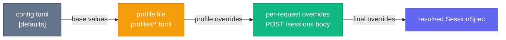

# Profile System

Profiles are TOML files stored in `profiles/` at the project root. They let you pre-configure agent behavior so callers only need to supply `action_prompt`. At startup, all `*.toml` files in `profiles/` are loaded into an in-memory `ProfileStore`.

---

## Profile file format

```toml
# profiles/my-profile.toml

# Which agent this profile targets. Optional — the caller must still pass
# "agent" in the POST /sessions body, but if the profile sets this it can
# serve as documentation / validation hint.
agent = "claude"

# System prompt text. Passed to the adapter as --append-system-prompt (Claude)
# or prepended to action_prompt (Copilot). Optional.
system_prompt = """
You are a task worker. Read carefully and execute in the working directory.
"""

[overrides]
# All keys below are optional. Any key left out falls back to config.toml [defaults].

model             = "sonnet"          # model name string
cwd               = "/path/to/repo"   # working directory (supports {{var}} templates)
permission_mode   = "acceptEdits"     # Claude: "default" | "acceptEdits" | "bypassPermissions"
allowed_tools     = ["Read", "Edit"]  # Claude tool allowlist
disallowed_tools  = []                # Claude tool blocklist
max_turns         = 40                # max tool-use iterations
max_budget_usd    = 2.0               # Claude spend cap
effort            = "high"            # reasoning effort hint ("low" | "medium" | "high")
mcp_configs       = []                # list of MCP config file paths
plugin_dirs       = []                # list of Claude plugin directory paths

[overrides.env]
# Extra environment variables (additive — merged with config defaults and request env).
MY_VAR = "value"
```

The `[overrides]` section is optional. A minimal profile can be just `agent` and `system_prompt`.

---

## Merge precedence



**Per-field rules** (implemented in `src/spec.rs:resolve_spec`):

| Field | Rule |
|-------|------|
| `model` | override > profile > config default |
| `permission_mode` | override > profile > config default |
| `cwd` | override > profile > config default > system temp dir |
| `system_prompt` | override > profile (config has no default) |
| `action_prompt` | **override only** — required, returns 400 if absent |
| `allowed_tools` | first non-empty wins: override > profile > config default |
| `disallowed_tools` | first non-empty wins: override > profile > config default |
| `max_turns` | override > profile (config has no default) |
| `max_budget_usd` | override > profile > config default |
| `effort` | override > profile > config default |
| `mcp_configs` | first non-empty list wins: override > profile |
| `plugin_dirs` | first non-empty list wins: override > profile |
| `cancel_grace_seconds` | override > config default (10 s) |
| `env` | **additive merge**: config defaults + profile env + override env |

---

## env merging rule

The `env` map is the only field that is merged additively across all three layers. Keys from later layers overwrite the same key from earlier layers, but keys unique to each layer are all included.

```
config [defaults.env]   → { "A": "1", "B": "2" }
profile [overrides.env] → { "B": "3", "C": "4" }
request overrides.env   → { "C": "5", "D": "6" }

resolved env            → { "A": "1", "B": "3", "C": "5", "D": "6" }
```

---

## `{{var}}` template interpolation

The `cwd` field (and only `cwd`) supports `{{key}}` placeholders. The `vars` map is built first — it is the merge of `profile.overrides.env` and `overrides.vars` — then every `{{key}}` in the resolved `cwd` string is replaced with the corresponding value.

**Example**

Profile:
```toml
[overrides]
cwd = "/workspaces/{{REPO}}"
```

Request:
```json
{ "overrides": { "vars": { "REPO": "myproject" }, "action_prompt": "…" } }
```

Resolved cwd: `/workspaces/myproject`

You can also put template values in `overrides.env` in the profile — they will be added to the `vars` map.

---

## Starter profiles

### `default`

General-purpose Claude task worker. Suitable for any coding task dispatched from To-Do.

```toml
agent = "claude"
system_prompt = """
You are a task worker. You will be given a task from the user's to-do list.
Read the task carefully, plan the required steps, and execute them in the
supplied working directory. Prefer minimal, focused changes.

When done, write a short summary (2-3 sentences) of what you did.
"""

[overrides]
allowed_tools = ["Read", "Edit", "Bash", "Grep", "Glob"]
max_turns = 40
```

### `pr-reviewer`

Code review tasks. Restricts Bash to only `gh pr *` and `git diff/log` commands to prevent unintended changes.

```toml
agent = "claude"
system_prompt = """
You are a code reviewer. You will be given a pull request review task.
Your job is to:
1. Identify the PR number or branch from the task description.
2. Fetch the diff (use `gh pr diff <number>` or `git diff <base>..<branch>`).
3. Review for: correctness, security issues, performance concerns, test coverage, and style.
4. Post a structured review summary.

Be direct and constructive. Flag blocking issues clearly. Approve when the change is sound.
"""

[overrides]
allowed_tools = ["Read", "Bash(gh pr *)", "Bash(git diff *)", "Bash(git log *)"]
max_turns = 20
```

### `bug-fixer`

Bug reproduction and minimal fix. Higher turn budget to allow deeper investigation.

```toml
agent = "claude"
system_prompt = """
You are a bug-fixing specialist. You will be given a bug report or error description.
Your job is to:
1. Reproduce or understand the failure from the description.
2. Identify the root cause by reading the relevant code.
3. Implement the minimal fix — do not refactor beyond what is necessary.
4. Verify the fix does not break adjacent behaviour.
5. Summarise the root cause and what you changed.

Do not introduce new features. Fix the bug and nothing else.
"""

[overrides]
allowed_tools = ["Read", "Edit", "Bash", "Grep", "Glob"]
max_turns = 50
```

### `docs-writer`

Technical writing and documentation updates. Includes `Write` but restricts Bash to safe read-only patterns.

```toml
agent = "claude"
system_prompt = """
You are a technical writer. You will be given a documentation task — writing, updating,
or reviewing docs for a software project.

Your job is to:
1. Read the relevant source code (and any existing docs) before writing.
2. Produce clear, accurate, audience-appropriate documentation.
3. Use Markdown. Add Mermaid diagrams when a flow or relationship is non-trivial.
4. Never document what the code "should" do — document what it actually does.
5. Summarise what you wrote and where the files landed.
"""

[overrides]
allowed_tools = ["Read", "Write", "Edit", "Bash(find * -name *.md)", "Grep", "Glob"]
max_turns = 30
```

---

## How profiles are loaded at startup

`ProfileStore::load(dir: &Path)` in `src/config.rs`:

1. Iterates all entries in the `profiles/` directory.
2. Skips files whose extension is not `.toml`.
3. Reads each file, parses it as `ProfileFile` (TOML).
4. Uses the filename stem (without `.toml`) as the profile name.
5. Inserts into a `HashMap<String, Profile>`.
6. The store is wrapped in an `Arc<RwLock<ProfileStore>>` in `AppState`.

Profiles are loaded once at startup. Changing a profile file requires restarting the server. The `GET /profiles` and `GET /profiles/:name` endpoints expose the in-memory store.
