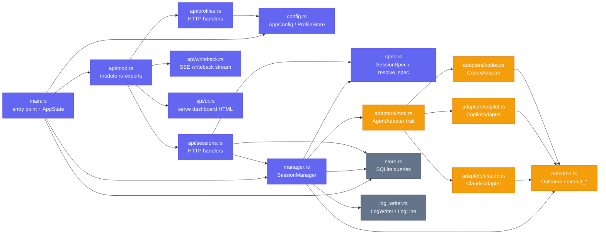

# Server internals

## Module map



## Source file reference

| File | Description |
|------|-------------|
| `src/main.rs` | Binary entry point: loads config, runs migrations, builds Axum router, starts server |
| `src/config.rs` | TOML config structs (`AppConfig`, `ServerConfig`, `ConcurrencyConfig`, `DefaultsConfig`); `ProfileStore` loads `profiles/*.toml` at startup |
| `src/spec.rs` | `SessionSpec` (resolved, snapshot), `SessionSpecPartial` (request body), `resolve_spec()` merge function |
| `src/manager.rs` | `SessionManager`: owns semaphores, live broadcast map, `spawn_session`, `run_session`, `cancel` |
| `src/adapters/mod.rs` | `AgentAdapter` trait definition and `adapter_for` factory |
| `src/adapters/claude.rs` | Builds `claude --print --verbose --output-format stream-json …` command |
| `src/adapters/copilot.rs` | Builds `copilot --prompt … --allow-all-tools …` command; handles tempfile agent definition |
| `src/adapters/codex.rs` | Builds `codex exec -m … -c instructions=… …` command |
| `src/outcome.rs` | `Outcome` struct; `extract_claude_outcome` (parses stream-json); `extract_text_outcome` (last line) |
| `src/store.rs` | All SQLite operations: pool creation, migrations, CRUD for sessions and events, writeback claim/ack |
| `src/log_writer.rs` | `LogWriter`: appends `[OUT]/[ERR]` lines to disk, broadcasts over `tokio::sync::broadcast` |
| `src/api/mod.rs` | Declares api sub-modules |
| `src/api/sessions.rs` | All session HTTP handlers (create, list, get, logs, stream, cancel, events, writeback-claim/ack) |
| `src/api/profiles.rs` | `GET /profiles` and `GET /profiles/:name` handlers |
| `src/api/writeback.rs` | `GET /writeback/stream` SSE handler |
| `src/api/ui.rs` | Serves the embedded `assets/index.html` at `GET /ui` |

## AppState

`AppState` is an `Arc`-wrapped struct shared across all Axum handler calls:

```rust
pub struct AppState {
    pub config: AppConfig,               // parsed config.toml (cloned at startup)
    pub manager: Arc<SessionManager>,    // owns semaphores, live map, broadcast TX
    pub profiles: Arc<RwLock<ProfileStore>>, // profiles/*.toml, read-locked per request
    pub writeback_tx: broadcast::Sender<WritebackSignal>, // cloned into manager too
}
```

`ProfileStore` sits behind a `RwLock` to allow future hot-reload without restarting. In the current codebase the store is only written once (at startup); all request-time accesses take a read lock.

`SessionManager` contains:

| Field | Type | Purpose |
|-------|------|---------|
| `pool` | `SqlitePool` | connection pool shared with all async tasks |
| `data_dir` | `PathBuf` | root for log files |
| `global_sem` | `Arc<Semaphore>` | max concurrent sessions across all agents |
| `claude_sem` | `Arc<Semaphore>` | per-agent limit for Claude |
| `copilot_sem` | `Arc<Semaphore>` | per-agent limit for Copilot |
| `codex_sem` | `Arc<Semaphore>` | per-agent limit for Codex |
| `live` | `Arc<Mutex<HashMap<String, broadcast::Sender<LogLine>>>>` | maps session ID to its live broadcast sender |
| `writeback_tx` | `broadcast::Sender<WritebackSignal>` | fires when a session with `external_task` finishes |
| `cancel_grace` | `u64` | seconds to wait before SIGKILL (v1 is best-effort) |

## Request flow

```
HTTP request
    │
    ▼
Axum router (main.rs:86-112)
    │  matches method + path
    ▼
Handler function (api/sessions.rs, api/profiles.rs, …)
    │  extracts State<Arc<AppState>>, Path, Query, Json
    │
    ├─ read profiles.read().await  (for create_session)
    │
    ├─ resolve_spec(agent, profile, overrides, config)
    │       merges defaults → profile → overrides
    │       returns SessionSpec or 400
    │
    ├─ manager.spawn_session(id, spec, …)
    │       inserts row into DB (status=queued)
    │       tokio::spawn run_session(…)
    │       returns immediately → 201 Created
    │
    │   Inside run_session (background Tokio task):
    │       acquire global_sem permit
    │       acquire agent_sem permit
    │       LogWriter::create (opens log file)
    │       registers broadcast sender in live map
    │       store::set_running (status=running)
    │       adapter.build_command(spec) → Command
    │       Command::spawn → Child process
    │       two tasks: read stdout/stderr → LogWriter::write
    │       child.wait() → exit_code
    │       adapter.extract_outcome(log, exit_code)
    │       store::set_finished (status=success/failed/…)
    │       if external_task → writeback_tx.send
    │       deregister from live map
    │       drop permits (semaphores released)
    │
    ▼
HTTP response (201 / 200 / 400 / 404 / 409 / 500)
```

SSE endpoints (`/sessions/:id/stream`, `/writeback/stream`) work differently: they return a streaming `Sse<…>` response that holds a `BroadcastStream` receiver open, emitting events as they arrive, until the child process finishes or the client disconnects.
