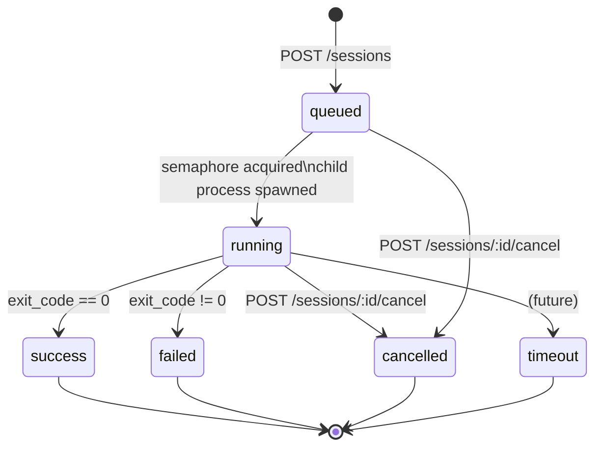
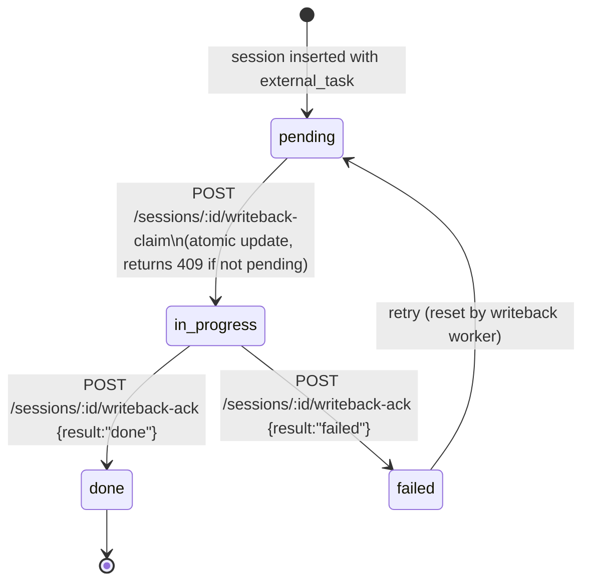

# Session Lifecycle

## State diagram



Note: State colors are applied via CSS in rendered Mermaid. The states map to the palette as:
- `queued` → muted grey (sto)
- `running` → indigo (srv)
- `success` → green (drv)
- `failed` → red/rose (usr)
- `cancelled` → amber (agt)
- `timeout` → amber (agt, not yet implemented)

---

## What happens at each transition

### `[*]` → `queued`

Triggered by `POST /sessions`.

1. Handler calls `resolve_spec` — merges defaults, profile, and overrides into a `SessionSpec`.
2. A UUID v7 session ID is generated (`Uuid::now_v7()`).
3. `manager.spawn_session(id, spec, …)` is called:
   - `store::insert_session` inserts a row with `status='queued'` and `queued_at=now()`.
   - If `external_task` is present, `writeback_status` is set to `'pending'`.
   - A log path is computed: `<data_dir>/logs/YYYY/MM/DD/<id>.log` (directory not created yet).
   - `tokio::spawn(run_session(…))` starts the background task.
4. `201 Created` is returned immediately with `{ "id": "…", "status": "queued" }`.

The Tokio task is now alive but immediately blocks on semaphore acquisition.

### `queued` → `running`

Triggered when both the global semaphore and the per-agent semaphore have an available permit.

1. `global_sem.acquire_owned().await` — blocks until a global slot is free.
2. `agent_sem.acquire_owned().await` — blocks until an agent-specific slot is free.
3. `LogWriter::create(log_path)` — creates parent directories and opens the log file in append mode. A `broadcast::Sender<LogLine>` is also created.
4. The session ID and broadcast sender are inserted into `manager.live` (the live map).
5. `store::set_running` — updates `status='running'` and `started_at=now()`.
6. `adapter.build_command(spec)` — builds the CLI `Command`.
7. `Command::spawn()` — forks the child process with `kill_on_drop(true)`.
8. Two Tokio tasks begin reading stdout and stderr, writing each line through `LogWriter::write` (which both appends to the file and broadcasts to SSE subscribers).

### `running` → `success` or `running` → `failed`

Triggered when the child process exits.

1. `child.wait().await` returns the exit status.
2. The stdout and stderr reader tasks are joined (`.await.ok()`).
3. The full log file is read into a string.
4. `adapter.extract_outcome(log, exit_code)` → `Outcome { kind, exit_code, summary, usage }`.
   - `exit_code == 0` → `OutcomeKind::Success`
   - `exit_code != 0` → `OutcomeKind::Failed`
5. `store::set_finished` — updates `status`, `finished_at`, `exit_code`, `outcome_summary`, `usage_json`.
6. If `external_task` is present: `store::insert_session_event(…, "terminal", payload)` and `writeback_tx.send(WritebackSignal { … })`.
7. The session ID is removed from `manager.live` (deregisters the broadcast sender).
8. The owned semaphore permits are dropped, releasing capacity.
9. The `LogWriter` is dropped (file handle closed).

### `running` → `cancelled` or `queued` → `cancelled`

Triggered by `POST /sessions/:id/cancel`.

1. `manager.cancel(id)` looks up the session row.
2. If `status` is not `running` or `queued`, returns `Ok(false)` → HTTP 409.
3. `store::set_finished` with `Outcome::cancelled("user requested cancellation")`.
4. If `external_task` is present, fires `writeback_tx.send`.
5. Returns `Ok(true)` → HTTP 200.

**Limitation (v1)**: The `SessionManager` does not hold a reference to the `Child` handle after spawning. When `set_finished` marks the session as `cancelled` in the DB, the child process continues until it finishes and its `run_session` task calls `set_finished` again (with the actual exit code). The second call overwrites the cancelled status. This is a known v1 limitation; a future version will store the `Child` in `manager.live` and send SIGTERM/SIGKILL.

The `kill_on_drop` flag on the `Command` ensures the child is killed when the `Child` handle is eventually dropped (at end of `run_session`).

### `running` → `timeout`

Not yet implemented. The `timeout` state exists in the schema and `OutcomeKind` enum but no timeout mechanism fires it yet.

---

## Crash recovery

At startup (step 6 of the startup sequence), `store::mark_running_as_cancelled` is called:

```sql
UPDATE sessions
SET status='cancelled', finished_at=now(), outcome_summary='server_startup'
WHERE status IN ('running', 'queued')
```

Any session that was in `running` or `queued` state when the server last died is immediately marked `cancelled`. This prevents sessions from being stuck in a running state forever. The server logs a warning if any sessions were recovered: `"Marked N stale sessions as cancelled on startup"`.

---

## Writeback sub-state

Sessions that carry an `external_task` reference have an additional `writeback_status` column that tracks whether the result has been pushed back to Microsoft Graph.



**Claim-then-ack** pattern prevents two writeback workers from processing the same session simultaneously:

1. Worker subscribes to `GET /writeback/stream`.
2. On `writeback` event: `POST /sessions/:id/writeback-claim` — atomically transitions `pending → in_progress` and increments `writeback_attempts`. Returns 409 if another worker already claimed it.
3. Worker calls Microsoft Graph PATCH.
4. `POST /sessions/:id/writeback-ack` with `result="done"` or `result="failed"` and optional refreshed etag JSON.

The `writeback_attempts` counter and `writeback_last_error` column are available for debugging stuck writebacks:

```bash
sqlite3 .orchapi/orchapi.db \
  "SELECT id, writeback_status, writeback_attempts, writeback_last_error
   FROM sessions WHERE writeback_status != 'done' AND external_task_json IS NOT NULL;"
```
