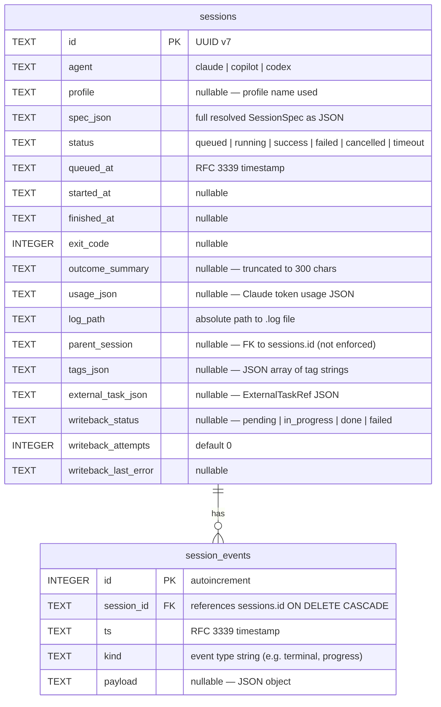

# Storage Layer

## ER diagram



### sessions indexes

| Index | Column(s) | Purpose |
|-------|-----------|---------|
| `sessions_status_idx` | `status` | Filtering by status in list queries |
| `sessions_agent_idx` | `agent` | Filtering by agent |
| `sessions_queued_idx` | `queued_at` | Ordering by time |
| `sessions_parent_idx` | `parent_session` | Looking up child sessions |
| `sessions_writeback_idx` | `writeback_status` | Writeback worker queries |

### session_events indexes

| Index | Column(s) | Purpose |
|-------|-----------|---------|
| `session_events_sid_idx` | `(session_id, ts)` | Fetching events for a session in order |

---

## Log file layout

### Path template

```
<data_dir>/logs/YYYY/MM/DD/<session-id>.log
```

The date components are computed from `chrono::Utc::now()` at the moment `spawn_session` is called (when the session is queued, not when it starts running). This means a session queued at 23:59 UTC will have a log path dated today, even if it doesn't start until after midnight.

**Example**: For session `0192abc…` queued on 2026-05-10:

```
.orchapi/logs/2026/05/10/0192abc….log
```

### Line format

Each line in the log file is prefixed with the stream identifier:

```
[OUT] <line of stdout text>
[ERR] <line of stderr text>
```

There is no timestamp per log line. The log file is append-only; stdout and stderr may be interleaved depending on Tokio scheduling.

**Reading logs**

```bash
# raw file
cat .orchapi/logs/2026/05/10/0192abc….log

# stdout only
grep '^\\[OUT\\]' .orchapi/logs/2026/05/10/0192abc….log | sed 's/^\[OUT\] //'

# stderr only
grep '^\\[ERR\\]' .orchapi/logs/2026/05/10/0192abc….log | sed 's/^\[ERR\] //'

# via API (same content, no prefixes stripped)
curl -s http://127.0.0.1:7878/sessions/0192abc…/logs
```

---

## How migrations work

Migrations are embedded as static string constants inside `src/store.rs` using `include_str!`:

```rust
let sql_init = include_str!("../migrations/0001_init.sql");
let sql_ext  = include_str!("../migrations/0002_external_task.sql");
```

They are applied in order at every server startup. The first migration uses `CREATE TABLE IF NOT EXISTS` and `CREATE INDEX IF NOT EXISTS` — safe to re-run. The second migration uses `ALTER TABLE … ADD COLUMN` statements, which SQLite silently no-ops if the column already exists (the store catches "duplicate column" and "already exists" errors and continues).

There is no migration version table. Adding a new migration means adding a new `include_str!` block and a new loop in `store::run_migrations`.

**Adding a migration**:

1. Create `migrations/0003_my_change.sql`.
2. Add to `src/store.rs`:
   ```rust
   let sql_new = include_str!("../migrations/0003_my_change.sql");
   for stmt in sql_new.split(';') { … }
   ```
3. Make each statement idempotent (`IF NOT EXISTS`, `ADD COLUMN IF NOT EXISTS`, or wrap in error-ignore logic).

---

## data_dir layout

```
.orchapi/                      ← data_dir (default: ./.orchapi)
├── orchapi.db                 ← SQLite database
└── logs/
    └── 2026/
        └── 05/
            └── 10/
                ├── 0192abc….log
                └── 0192def….log
```

The `data_dir` is created by `std::fs::create_dir_all` at startup. Log subdirectories are created by `LogWriter::create` (via `tokio::fs::create_dir_all`) when the first line is written.

---

## Manual sqlite3 queries

```bash
# open the database
sqlite3 .orchapi/orchapi.db

# count sessions by status
SELECT status, COUNT(*) FROM sessions GROUP BY status;

# recent failures with their summaries
SELECT id, agent, profile, queued_at, outcome_summary
FROM sessions
WHERE status = 'failed'
ORDER BY queued_at DESC
LIMIT 10;

# sessions still waiting for writeback
SELECT id, agent, writeback_status, writeback_attempts, writeback_last_error
FROM sessions
WHERE writeback_status IN ('pending', 'in_progress', 'failed')
ORDER BY queued_at ASC;

# average session duration (finished sessions only)
SELECT agent,
       AVG((julianday(finished_at) - julianday(started_at)) * 86400) AS avg_seconds
FROM sessions
WHERE started_at IS NOT NULL AND finished_at IS NOT NULL
GROUP BY agent;

# events for a specific session
SELECT ts, kind, payload
FROM session_events
WHERE session_id = '0192abc…'
ORDER BY id ASC;

# sessions by tag (tags stored as JSON array)
SELECT id, agent, status, tags_json
FROM sessions
WHERE tags_json LIKE '%todo:abc%';

# sessions queued today
SELECT id, agent, status, queued_at
FROM sessions
WHERE queued_at >= date('now')
ORDER BY queued_at DESC;
```

```bash
# Useful shell one-liners

# count running
sqlite3 .orchapi/orchapi.db "SELECT COUNT(*) FROM sessions WHERE status='running';"

# show log for most recent session
LAST=$(sqlite3 .orchapi/orchapi.db "SELECT log_path FROM sessions ORDER BY queued_at DESC LIMIT 1;")
cat "$LAST"

# pretty-print spec for a session
sqlite3 .orchapi/orchapi.db "SELECT spec_json FROM sessions WHERE id='0192abc…';" | python3 -m json.tool
```
