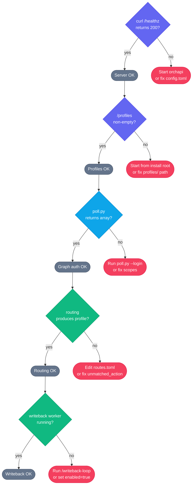

# Troubleshooting

---

## Symptom / cause / fix table

| Symptom | Likely cause | Fix |
|---|---|---|
| `claude: command not found` (or `copilot`, `codex`) | The agent CLI binary is not on `PATH`, or the wrong agent name is configured in the profile. | Install the missing CLI (see [installation.md](installation.md) prerequisites). Ensure `~/.local/bin` or `~/.npm/bin` (for npm-installed CLIs) is on your `PATH`. Run `which claude` to verify. |
| `No profiles found` or `GET /profiles` returns `[]` | The server was started from a directory that does not contain a `profiles/` subdirectory. | Stop the server and restart from the install root: `cd ~/.local/share/orchapi && ./target/release/orchapi`. The launcher (`orchapi`) does this automatically. Or set `cwd` in a `systemd` unit / launchd plist to the install root. |
| `409 Conflict` on `POST /sessions/:id/writeback-claim` | Two writeback consumers (SSE thread + poll-fallback thread, or two separate workers) both tried to claim the same session simultaneously. | This is normal behavior and is handled automatically. The second claimant receives 409 and skips the session. If you see repeated 409 errors in logs without any successful acks, check that only one writeback worker is running. |
| `412 Precondition Failed` on Microsoft Graph PATCH | The To-Do or Planner etag stored at dispatch time is stale — the task was modified in Graph between dispatch and writeback. | This is handled automatically by `writeback.py`: it re-GETs the resource for a fresh etag and retries the PATCH once. If you see this in stderr it is informational. If the retry also fails, the writeback-ack records `"failed"` and the task body is not updated. |
| `Auth error: no accounts in cache` | `state/token_cache.bin` is missing (first run, or deleted) or the refresh token has expired. | Run `python3 .claude/skills/todo-poll/poll.py --login` from the `driver/` directory (with `.venv` activated). Follow the device-code prompt. |
| `Tasks.ReadWrite scope not found` or `403 Forbidden` on To-Do PATCH | The cached token was issued with `Tasks.Read` (read-only) scope from a previous version of the driver, and now writeback needs write access. | Delete the token cache and re-login: `rm driver/state/token_cache.bin && python3 .claude/skills/todo-poll/poll.py --login`. This triggers a new consent screen that requests `Tasks.ReadWrite`. |
| `Group.ReadWrite.All scope not granted` or `403 Forbidden` on Planner PATCH | The token does not include `Group.ReadWrite.All`. Either the scope was not requested, or admin consent is required in your tenant. | Delete the cache and re-login. If your Entra tenant requires admin consent for `Group.ReadWrite.All`, contact your IT admin or register your own app with pre-consented permissions. |
| `poll.py returns empty array` | No pending (non-completed) tasks exist in your To-Do lists, **or** you are signed in to the wrong Microsoft account. | This is expected when there are no tasks. To check the account: run `--login` to force re-authentication. The device-code prompt shows the tenant/account used. |
| `Cargo.lock conflict` or build failure (`error[E0XXX]`) | Stale `Cargo.lock`, incompatible Rust toolchain, or a missing system library (openssl-sys on Linux). | Run `rustup update stable` to ensure the latest stable toolchain. On Debian/Ubuntu, install `build-essential pkg-config libssl-dev`. Then `cargo clean && cargo build --release`. |
| `Session stuck in queued` | The server concurrency cap (`[concurrency] global` in `config.toml`) is reached and no running sessions are finishing. | Wait for running sessions to complete. Or increase `[concurrency] global` in `config.toml` and restart the server. Or cancel some running sessions via the dashboard or `DELETE /sessions/:id`. |
| `In-flight cap reached, skipping dispatch` | The driver's `max_in_flight` limit (`[orchapi] max_in_flight` in `driver.toml`) is reached. The **driver** is intentionally not dispatching more tasks this cycle. | This is normal when `max_in_flight` running+queued sessions exist. Wait for sessions to complete. Increase `max_in_flight` in `driver/config/driver.toml` if you want more parallel work. |
| Dashboard shows nothing / blank page | The orchapi server is not running, or you are connecting to the wrong port. | Confirm the server is running: `curl -s http://127.0.0.1:7878/healthz`. If it returns connection refused, start the server. If you changed `bind` in `config.toml`, use the correct port. |
| `500 Internal Server Error` on `POST /sessions` | The request body is missing `action_prompt` (either via a profile field or the `overrides.action_prompt` key) — this is a required field. | Ensure the request body includes `overrides.action_prompt` or that the target profile has an `action_prompt` set. The dispatch spec from the driver always includes it; this error most often occurs during manual `curl` testing. |
| Writeback not completing / tasks remain incomplete in To-Do | The writeback worker is not running, `writeback.enabled = false` in `driver.toml`, or the worker started before the token cache had write scopes. | Start the writeback worker: `/writeback-loop` in the driver Claude Code session. Check `driver/config/driver.toml` that `[writeback] enabled = true`. If the token was issued with read-only scope, re-authenticate (see scope upgrade row above). |
| `orchapi unreachable` in driver output | The orchapi server is not running, or `base_url` in `driver.toml` points to the wrong address/port. | Start the server. Verify `[orchapi] base_url` in `driver/config/driver.toml` matches the `[server] bind` address in `config.toml`. |
| LLM fallback fires for every task | No `routes.toml` exists, or `unmatched_action = "llm_fallback"` with no matching rules for your lists. | Copy `routes.toml.example` to `routes.toml` and add rules for your To-Do list names. See [driver-router.md](driver-router.md). Alternatively set `unmatched_action = "default_profile"` if you want all unmatched tasks dispatched with a single profile. |
| Planner enrichment missing (`"planner": null` for Planner tasks) | The Planner API call timed out (5-second timeout) or returned an error, or you are in PowerShell mode (which never fetches Planner data). | Check stderr output from `poll.py` for `Warning: Planner fetch for ...`. This may indicate a permissions issue (needs `Group.ReadWrite.All`) or network latency. Re-authenticate if needed. Switch from PowerShell mode to MSAL mode for Planner enrichment. |
| `error: feature `let_chains` is required` or similar compile error | Rust toolchain is older than 1.75. | `rustup update stable` or install Rust via `rustup` (see [installation.md](installation.md)). |
| `ModuleNotFoundError: No module named 'msal'` | Python venv not activated, or `requirements.txt` not installed. | `source driver/.venv/bin/activate` and then `pip install -r driver/requirements.txt`. |

---

## Debugging checklist

Work through these steps in order when something is wrong and you are not sure where to start.

1. **Is the server running?**
   ```bash
   curl -s http://127.0.0.1:7878/healthz
   ```
   If this fails with "connection refused", start the server (`orchapi`) and retry.

2. **Is the server using the right config?**
   Check `config.toml` in the working directory from which you launched the server. The launcher script `cd`s to the install root; `cargo run` uses the repo root.

3. **Are profiles loaded?**
   ```bash
   curl -s http://127.0.0.1:7878/profiles | python3 -m json.tool
   ```
   Empty array means the server can't find `profiles/`. See the "No profiles found" row above.

4. **Can poll.py reach Microsoft Graph?**
   ```bash
   cd driver && source .venv/bin/activate
   python3 .claude/skills/todo-poll/poll.py
   ```
   If this fails with an auth error, run `--login`. If it hangs, check your network/proxy.

5. **Does routing work for your tasks?**
   ```bash
   echo '{"id":"test","listId":"x","listName":"Coding","title":"Test","body":"","source":"todo","planner":null}' \
     | python3 .claude/skills/todo-router/router.py
   ```
   If it returns `llm_fallback` when you expect a match, check your `routes.toml` list names and regex patterns.

6. **Check driver.toml settings:**
   - `base_url` points to your running server.
   - `max_in_flight` is not set too low.
   - `writeback.enabled = true` if you want writeback.
   - `graph.mode` is `msal` unless you intentionally switched to `powershell`.

7. **Check seen.sqlite for duplicate/stale entries:**
   ```bash
   sqlite3 driver/state/seen.sqlite \
     "SELECT task_id, etag, dispatched_at, session_id, status FROM seen ORDER BY dispatched_at DESC LIMIT 10;" \
     -column -header
   ```

8. **Check session logs for agent errors:**
   ```bash
   ls -lt ~/.local/share/orchapi/.orchapi/logs/$(date +%Y/%m/%d)/
   tail -50 ~/.local/share/orchapi/.orchapi/logs/$(date +%Y/%m/%d)/<session-id>.log
   ```

9. **Enable verbose server logging:**
   ```bash
   RUST_LOG=orchapi=debug orchapi
   ```
   Look for session state transitions, dispatch errors, and writeback events.

10. **Re-authenticate with Microsoft Graph if in doubt:**
    ```bash
    rm driver/state/token_cache.bin
    python3 .claude/skills/todo-poll/poll.py --login
    ```
    Then restart the writeback worker.

---

## Component health summary diagram


